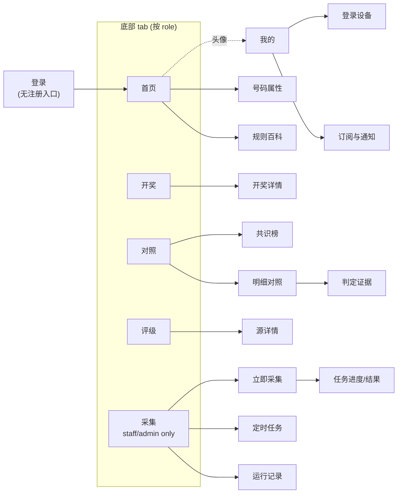
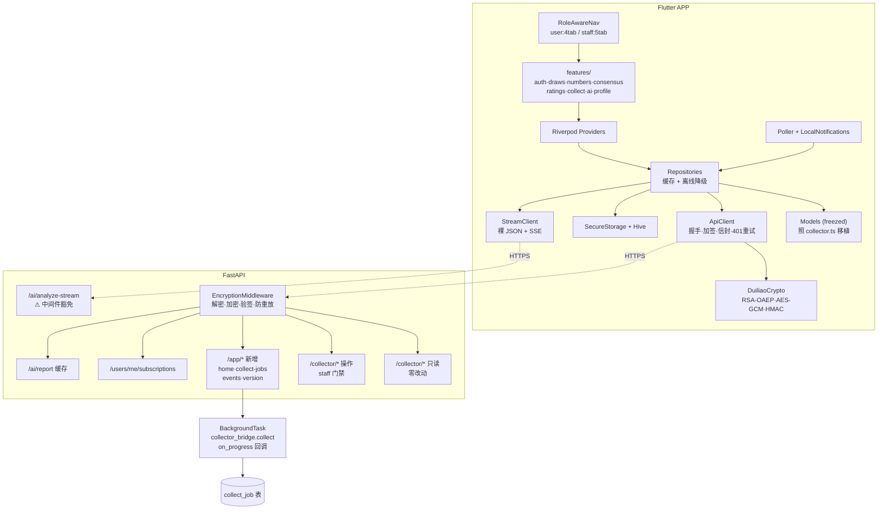
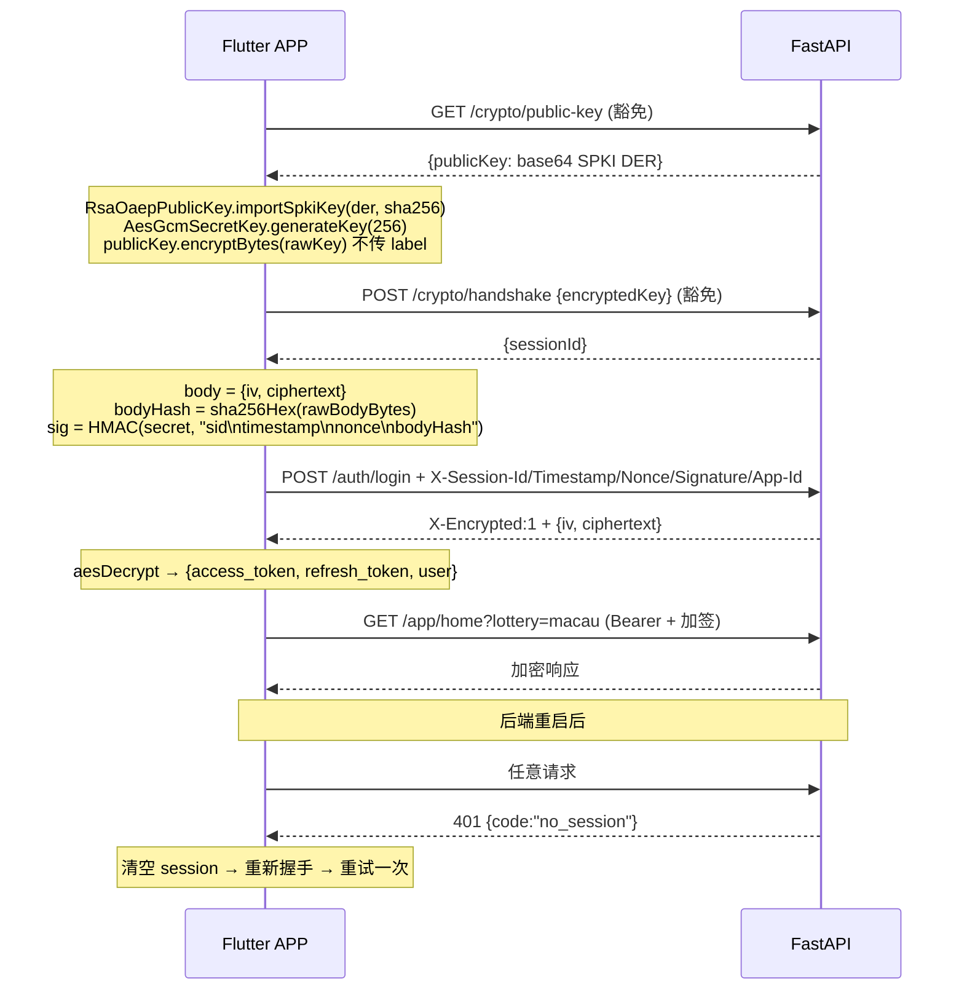
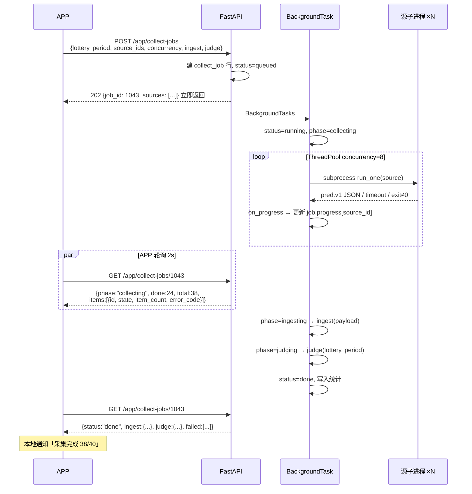

# Duiliao 移动端 APP 实施方案

> 状态：已确认，待执行
> 目标平台：Flutter（Android + iOS），内部分发
> 关联代码：`backend/`（FastAPI）、`frontend/`（React 管理后台，作为契约参考）

---

## 1. 问题陈述

现有 `duiliao` 是一套六合彩预测源可信度评估平台，后端 FastAPI + 双数据库隔离，前端是 React 管理后台形态。

现在要做一个 **Flutter 运营随身端 APP**，内部分发，让运营人员在手机上完成：看开奖、查跨源共识、评估预测源可信度、以及**执行采集任务**。

---

## 2. 已确认的需求

| 项 | 决定 |
|---|---|
| 定位 | 运营随身端。账号由管理员在 Web 后台创建，**APP 无注册入口** |
| 技术栈 | Flutter / Dart，UI 与加密层全部重写 |
| 加密层 | 1:1 全量移植（RSA-OAEP-SHA256 + AES-256-GCM + HMAC 签名 + nonce），后端传输层**零改动** |
| 权限 | 登录即可用所有只读功能；采集 tab 按 `role` 隐藏（`user` 4 tab，`staff`/`admin` 5 tab） |
| 采集执行 | 纳入范围，含**逐源实时进度** |
| 通知 | 轮询 + 本地通知，不引入第三方推送 |
| 底部导航 | 首页 / 开奖 / 对照 / 评级 / 采集，「我的」在首页右上头像 |
| 分发 | Android APK 直装 + iOS TestFlight / Ad Hoc，**不上架** |

### 关于不上架的说明

彩票预测类内容上架公开商店的驳回风险很高（App Store 审核指南 4.7/5.3 对博彩相关内容有地域牌照要求，Google Play 的 Real-Money Gambling 政策同样）。选择内部分发后，功能设计不受该约束，但也意味着**不能依赖 Google Play 服务**（FCM 在国内 Android 不可靠），这是选择「轮询 + 本地通知」而非服务端推送的直接原因。

---

## 3. 背景：代码确认的关键事实

以下均为读代码确认，非 README 转述。

### 3.1 可零改动复用的只读接口（`_user` 角色即可）

```
GET  /crypto/public-key                 (中间件豁免)
POST /crypto/handshake                  (中间件豁免)
POST /auth/login  /auth/refresh  /auth/logout
GET  /auth/me
GET  /users/me        PATCH /users/me
GET  /users/me/sessions    DELETE /users/me/sessions/{id}
POST /users/me/password
GET  /collector/draws        ?lottery&limit&offset&period_from&period_to
GET  /collector/predictions  ?lottery&period&source_id&limit
GET  /collector/consensus    ?lottery&period&play_type
GET  /collector/comparison   ?lottery&period
GET  /collector/ratings      ?lottery&play_type&windows&period_from&period_to
GET  /collector/monitor      ?lottery
GET  /collector/numbers      ?date
GET  /collector/rules
GET  /collector/sources  /sources/{id}  /families
GET  /collector/schedules  /schedules/{id}  /schedules/{id}/logs
GET  /collector/draw-scheduler
GET  /collector/catalog/status
GET  /ai/prompts
```

### 3.2 需 staff/admin 的操作接口

```
POST /collector/collect
POST /collector/ingest
POST /collector/draws/sync
POST /collector/judge
POST /collector/comparison/judge
POST /collector/sources/{id}/test
POST /collector/scripts/{name}/run
POST /collector/schedules  PUT/DELETE /schedules/{id}
POST /collector/schedules/{id}/trigger
POST /collector/missing/confirm
POST /collector/catalog/scan
```

### 3.3 前端已有的完整类型契约

`frontend/src/lib/collector.ts` 已把全部响应结构 TypeScript 化：

`DrawRow` / `DrawSummary` / `NumberAttr` / `LianxiaoGroup` / `AdjacentLianxiao` / `PredAtom` / `ConsensusResult` / `ConsensusGroup` / `AtomTallyItem` / `RatingsResult` / `RatingRow` / `MonitorRow` / `RuleRow` / `PeriodComparisonResult` / `ComparisonItem` / `CollectorSource` / `CollectionSchedule` / `ScriptRunResult` / `DrawSchedulerStatus` / `CatalogStatus`

**Dart 模型层照它 1:1 移植即可**，不需要反推后端。这省掉大量工作。

### 3.4 领域约束

- **彩种** 4 个：`hk` / `macau` / `taiwan` / `new`（`collector/common/period.py:6`）
- **期号**：统一 `年4位 + 序号3位`，如 `2026248`
- **玩法** 21 种（`collector/rules.py`，`VERSION = "2026-09-06.2"`）：
  特码 / 特肖 / 特尾 / 特头 / 特波 / 两面 / 半波 / 合肖 / 平特肖 / 平特尾 / 连肖 / 连尾 / 正码 / 正肖 / 二中二 / 三中三 / 三中二 / 二中特 / 不中码 / 杀肖 / 杀尾
- **号码属性**分两类：
  - 固定属性：波色 / 大小 / 单双 / 头 / 尾 / 合数（`number_info` 表）
  - 按农历年轮转：生肖 / 家野 / 五行（`number_year_attr` 表，键含 `lunar_year`）
  - 2026 附加元数据：灵码称谓 / 花 / 时辰 / 地支 / 生肖色 / 笔画（`number_code_meta`），生肖分类（`xiao_year_meta`）
- **判定证据**：每条 `JudgeResult.hit_detail` 含 `explanation`、`rule`、`rule_version`、`draw_snapshot`、`prediction_snapshot`
- **共识去重**：同站族（`site_family`）+ 近似文本只计 1 票，防跳板镜像刷票（`consensus.py`）
- **评级口径**：`analytics.ratings()` 区分**开奖前快照命中率**（`before_rate`）与**开奖后命中率**（`after_rate`），并统计改料次数（`after_edits`）——这是识别「开奖后改料充业绩」的核心指标

### 3.5 五个必须在方案里处理的现状问题

#### (1) 采集是同步阻塞的

`app/collector_bridge.py:collect()` 用 `executor.map()`，跑完全部源才返回。

- 默认并发 8（`concurrency: int = 8`）
- 每源 `timeout_sec` 默认 30s（`runner.py:71`）
- 40+ 源最坏情况 ≈ 40 / 8 × 30 = **150 秒**

移动端 HTTP 请求会超时。**必须改成提交 + 轮询。**

#### (2) session_store / nonce_cache 是进程内内存

`app/core/crypto.py:95` 的 `SessionKeyStore` 用 `Dict` + `Lock`，纯内存。

- 后端重启后全体 APP 拿到 `401 {code: "no_session"}`
- Dart 客户端必须复刻 `frontend/src/lib/api.ts:180` 的重握手重试逻辑
- 多实例部署会导致随机 401 —— **Redis 之前必须保持单实例，这是硬约束不是优化项**

#### (3) `/ai/analyze-stream` 完全豁免加密与验签

`app/middleware/encryption.py:50` 的 `_exempt()` 把 `f"{_PREFIX}/ai/analyze-stream"` 列入豁免集合。该端点既不加密也不验签，只有 JWT 保护。

Dart 侧需要一条独立的裸 JSON + SSE 通道，与主加密通道两套代码路径。

#### (4) `analyze-588080` 默认 `fetch_fresh=True`

`app/api/v1/ai.py` 的 `AIAnalyzeRequest.fetch_fresh` 默认 `True`，意味着**每次调用都由 API 进程外连 588080 + 调 LLM**。

这既违反 collector「只有子进程碰网络」的设计约定，也让每个用户点一次就产生一次外连和一次 LLM 计费。必须加服务端缓存。

#### (5) `APP_SIGNING_SECRET` web/app 共用单一密钥

`app/core/security.py` 的 `verify_signature` 只认一个密钥。APP 先复用同一个，按 `X-App-Id` 区分密钥列为后续加固项。

### 3.6 好消息：逐源进度的改动比预估小

`collector_bridge.collect()` 有一份**独立的** ThreadPool 循环（从 `runner.main()` 复制而来），因此：

- 回调钩子加在 `collector_bridge.collect()`，把 `executor.map()` 换成 `submit()` + `as_completed()`，包一层 `on_start` / `on_done` 回调
- **`runner.py` 完全不动**（`run_one()` 已返回完整的单源结果字典，`main()` 是独立的 CLI 路径）
- 线框图要的每个字段都已存在：`source_id`、`ok`、`exit_code`、`elapsed_ms`、`item_count`、`error_code`、`error_msg`、`stdout`、`stderr`

风险因此显著降低——CLI 行为零影响。

---

## 4. 功能清单

### M1 账号与安全

1. 登录（identifier = 邮箱 / 手机 / 用户名），**无注册入口**
2. Token 管理：access 仅内存，refresh 存 `flutter_secure_storage`
3. 401 自动刷新；刷新失败登出
4. 加密会话自动恢复（`no_session` → 重握手 → 重试一次）
5. 服务端时间偏移校准（握手时记录 offset，签名用校准时间，规避 `bad_timestamp`）
6. 登录设备列表 + 单设备下线 + 全设备登出
7. 修改密码、编辑资料
8. 生物识别解锁

### M2 开奖

9. 开奖列表：4 彩种 tab、分页、下拉刷新
10. 开奖详情：z1–z6 落球顺序 + 特码分区，号码球带色名文字（不只靠颜色）
11. 逐球完整属性：生肖 / 家野 / 波色 / 大小 / 单双 / 头 / 尾 / 合数 / 五行 + 灵码
12. 期号汇总：七球和值及大小单双、特码全属性、半波
13. 连肖检测：同肖分组 + 顺位紧邻标记
14. 期号区间筛选

### M3 号码属性百科

15. 01–49 属性总表（按日期，生肖随农历年轮转）
16. 2026 灵码：称谓 / 花 / 时辰 / 地支 / 生肖色 / 笔画
17. 生肖分类：天地肖 / 阴阳肖 / 男女肖 / 吉凶肖 / 季节 / 方位
18. 属性反查：多维筛选组合
19. 五行缺表年份显式提示（`wuxing_available` / `wuxing_years`）

### M4 对照与共识

20. 共识榜：按玩法分组、票数排序、领先方案高亮
21. 投票明细：方案的投票源列表（含 `／第N组` 后缀）
22. 特码热度榜（01–49 频次 + 百分比 + 源）
23. 特肖热度榜（12 生肖同上）
24. 期号明细对照：开奖 + 全源预测 + 判定 + 汇总
25. 冲突态突出：源自称中但实判挂
26. 判定证据抽屉：`explanation` / `rule` / `rule_version` / 开奖快照 / 预测快照 / 采集原文
27. 玩法规则百科（21 种，按 `scope` 分组）

### M5 源评级

28. 评级榜：彩种 + 玩法，30 / 50 / 100 三窗口
29. 诚信指标：开奖前 vs 开奖后命中率、改料次数、脏源标记
30. 连续性：连中 / 连挂 / 当前状态
31. 覆盖质量：缺期 / 待判 / 未覆盖，样本不足显式告警
32. 源详情：基本信息 + 历史预测流水 + 健康度

### M6 采集执行（staff/admin）

33. 立即采集：彩种 / 期号（可自动检测）/ 数据源多选 / 并发滑杆 / ingest + auto-judge 开关
34. **逐源实时进度**：排队 ○ / 运行中 ◌ / 成功 ✓ / 失败 ✗ + 条数 + 错误码
35. 任务结果：入库统计 + 判定统计 + 失败源清单
36. 失败源一键重采
37. 单源试跑（stdout / item_count / 耗时），现场排查用
38. 任务取消
39. 定时任务：列表 / 启停 / 手动触发 / 日志（**不做创建编辑**）
40. 运行记录：按日分组的历史任务流水
41. 开奖同步 + 重新判定手动触发（入口在开奖详情页）

### M7 AI 研判

42. 预置提示词列表
43. 读服务端缓存报告，Markdown 渲染
44. 流式生成（staff/admin 限定）

### M8 订阅与通知

45. 关注数据源（服务端存储，多设备同步）
46. 默认彩种 / 玩法偏好
47. 通知规则：新开奖 / 关注源命中 / 连挂 ≥N / 共识 Top 变动 / 采集任务完成或失败
48. 前台轮询 + 后台周期任务 + 本地通知，游标持久化防重复
49. 消息中心（已读 / 未读）

### M9 体验层

50. 离线缓存（开奖 / 号码属性 / 规则持久化，断网可读 + 离线横幅）
51. 骨架屏 / 空态 / 错误态带重试
52. 深色模式、字号
53. 版本更新检查 + APK 安装引导

### 明确不做

脚本编辑、源 CRUD、定时任务创建编辑、目录扫描、数据库 schema 修复、AI 提供商配置、SQLite 导入。全部留在 Web 后台。

---

## 5. 页面线框图

### 5.1 导航结构



### 5.2 登录

```
┌─────────────────────────────────────────
│                                  ○ 连接中
├─────────────────────────────────────────
│
│
│                 对   料
│          预测源可信度评估 · 内部版
│
│
│   账号  ▏邮箱 / 手机 / 用户名
│   ──────────────────────────────────
│   密码  ▏••••••••                   👁
│   ──────────────────────────────────
│
│            [[     登  录     ]]
│
│            [ 指纹解锁 ]
│
│              ● 加密通道已建立
│
│
│   账号由管理员在 Web 后台创建
│   APP 不提供注册入口
│
└─────────────────────────────────────────
```

登录失败态复用后端返回码：密码错误剩余次数、`account_locked`（15 分钟）、`bad_timestamp`（提示「设备时间不准，请校准」）、`no_session`（自动重握手，用户无感）。

### 5.3 首页

```
┌─────────────────────────────────────────
│  对料             澳门 ▾        ● admin
├─────────────────────────────────────────
│
│  ┌ 最新开奖   2026248   01-15 周四 ────
│  │
│  │   ①    ②    ③    ④    ⑤    ⑥    特
│  │  ╭──╮ ╭──╮ ╭──╮ ╭──╮ ╭──╮ ╭──╮ ╭──╮
│  │  │32│ │07│ │38│ │05│ │17│ │39│ │23│
│  │  ╰──╯ ╰──╯ ╰──╯ ╰──╯ ╰──╯ ╰──╯ ╰──╯
│  │   绿   红   绿   绿   绿   绿   红
│  │   猪   鼠   蛇   虎   虎   龙   猴
│  │
│  │  和值 161 · 单      特码 小·单·合单
│  │  半波 红小单        ⚠ 连肖 虎×2 ④⑤紧邻
│  └──────────────────────────── 详情 ›
│
│  ┌ 本期共识 ────────────────── 全部 ›
│  │  特肖    龙   ██████████  9票/24源
│  │  特码    38   ███████     6票
│  │  平特肖  鼠   █████       5票
│  └────────────────────────────────────
│
│  ┌ 本期对照 ────────────────── 明细 ›
│  │  总计 44   ✓中 12   ✗挂 29   ⚠冲突 3
│  │  命中率 29.3%             待判 0
│  └────────────────────────────────────
│
│  ┌ 源评级 Top5 · 平特肖 ────── 排行 ›
│  │  1  海哥平特         63%   连中 3
│  │  2  精选⑧肖          57%
│  │  3  九肖模块③肖      52%   ⛔ 改料 12
│  │  4  黑庄平特         48%
│  │  5  综合6肖18码      44%
│  └────────────────────────────────────
│
│  ┌ 采集状态 ────────────────── 采集 ›
│  │  最后运行 21:05   成功 38/40  ⚠失败2
│  │  定时任务 3 启用      下次 21:10
│  └────────────────────────────────────
│
│  ┌────────────┬────────────┬──────────
│  │ 号码属性    │ 规则百科    │ 消息 3
│  └────────────┴────────────┴──────────
│
├─────────────────────────────────────────
│  ●首页   开奖   对照   评级   采集
└─────────────────────────────────────────
```

这一屏由新增的 `GET /app/home?lottery=` 一次请求返回，避免冷启动打 5 个请求。

### 5.4 采集执行 — 立即采集

```
┌─────────────────────────────────────────
│  采集执行                      admin ✓
├─────────────────────────────────────────
│  [●立即采集]  [ 定时任务 ]  [ 运行记录 ]
├─────────────────────────────────────────
│
│  彩种    ▏澳门 ▾
│  ──────────────────────────────────────
│  期号    ▏2026248        ☑ 自动检测最新
│  ──────────────────────────────────────
│  数据源  ▏全部启用 38 个            选择 ›
│  ──────────────────────────────────────
│  并发    ▏1 ──────────●──── 16    当前 8
│  ──────────────────────────────────────
│  ☑ 采集后自动入库        (ingest)
│  ☑ 入库后自动判定        (auto judge)
│
│           [[     开始采集     ]]
│
│  ⓘ 采集在服务端后台执行，约 30–150 秒
│    可离开本页，完成后本地通知提醒
│
└─────────────────────────────────────────
```

**运行中**

```
├─ 当前任务 #1043 ───────────── ◌ 运行中 ─
│
│  ██████████████░░░░░░░░░   24 / 38
│  已用 47s                    [ 取消 ]
│
│  ✓ haige_pingte       海哥平特      1 条
│  ✓ heizhuang_pingte   黑庄平特      1 条
│  ✓ guanjun_xinshui    冠军心水      1 条
│  ✓ huobao_qima        火爆七码      2 条
│  ✗ facai_xianfeng     发财先锋   timeout
│  ◌ wu_buzhong         五不中      运行中
│  ◌ chengba_liuhe      称霸六合    运行中
│  ○ dingjian_30ma      顶尖30码      排队
│  ○ tema_18ma          18码中特      排队
│                              展开全部 ›
└─────────────────────────────────────────
```

**已完成**

```
├─ 任务 #1043 ────────────────── ✓ 完成 ─
│
│  耗时 68s          数据源 38 / 40 成功
│  run_id  20260115-210512-a3f9
│
│  ┌ 入库 ────────────────────────────
│  │  新增 31    更新 5    未变 2   补缺 0
│  └──────────────────────────────────
│  ┌ 判定 ────────────────────────────
│  │  已判 36    ✓命中 11    ⚠自称冲突 2
│  └──────────────────────────────────
│  ┌ ✗ 2 个源失败 ─────────────────────
│  │  facai_xianfeng   timeout 30s
│  │  jiaye_zhongte    exit 1 · 解析失败
│  │                          查看日志 ›
│  └──────────────────────────────────
│
│  [ 查看本期对照 ]    [ 只重采失败源 ]
└─────────────────────────────────────────
```

**数据源选择（抽屉）**

```
┌─────────────────────────────────────────
│  选择数据源              已选 38 / 46
├─────────────────────────────────────────
│  🔍 搜索源名 / ID
│  玩法 ▾ 全部     站族 ▾ dingjian_dashi
│  [ 全选 ] [ 反选 ] [ 仅启用 ] [ 清空 ]
├─────────────────────────────────────────
│  ☑ 海哥平特        pingte_xiao   ● 启用
│    haige_pingte              最近 21:05
│  ☑ 黑庄平特        pingte_xiao   ● 启用
│    heizhuang_pingte          最近 21:05
│  ☑ 冠军心水一肖四码  texiao       ● 启用
│    guanjun_xinshui           最近 21:05
│  ☐ 发财先锋        texiao        ○ 停用
│    facai_xianfeng      ⚠ 上次 timeout
│  ☐ 家野中特        tema_twoface  ○ 停用
│    jiaye_zhongte       ⚠ 上次 解析失败
│  …
├─────────────────────────────────────────
│  长按单个源 → [ 单独试跑 ] 查看 stdout
└─────────────────────────────────────────
```

### 5.5 采集执行 — 定时任务 / 运行记录

```
│  [ 立即采集 ]  [●定时任务]  [ 运行记录 ]
├─────────────────────────────────────────
│  调度器  ● 运行中    检查间隔 30s
│  进行中  1 个   #1043
├─────────────────────────────────────────
│  ┌ 澳门晚间全量采集 ──────────── ● 启用
│  │  澳门 · 全部源 · 并发 8
│  │  窗口 21:00–21:30 每 5 分钟 · 每日
│  │  上次 21:05 ✓成功     下次 21:10
│  │  ☑ 入库   ☑ 判定
│  │              [ 立即执行 ]    日志 ›
│  └────────────────────────────────────
│  ┌ 香港开奖日采集 ────────────── ○ 停用
│  │  香港 · 12 个源 · 并发 4
│  │  cron  0,30 21 * * 2,4,6
│  │  上次 01-13 21:30 ✓成功
│  │              [ 立即执行 ]    日志 ›
│  └────────────────────────────────────
│
│  ⓘ 新建 / 编辑定时任务请在 Web 后台操作
│    APP 只提供查看、手动触发、启停与日志
└─────────────────────────────────────────
```

```
│  [ 立即采集 ]  [ 定时任务 ]  [●运行记录]
├─────────────────────────────────────────
│  今天
│  ✓ 21:05  #1043  澳门 2026248
│     38/40 源 · 新增31 更新5 · 68s
│  ✓ 21:00  #1042  澳门 2026248
│     40/40 源 · 新增40 更新0 · 71s
│  ✗ 20:55  #1041  澳门 2026248
│     0/40 源 · 全部 timeout · 网络异常
├─────────────────────────────────────────
│  01-14
│  ✓ 21:10  #1038  澳门 2026247
│     39/40 源 · 新增12 更新27 · 64s
│  …
└─────────────────────────────────────────
```

### 5.6 开奖详情

```
┌─────────────────────────────────────────
│  ‹  澳门 2026248               01-15 周四
├─────────────────────────────────────────
│  落球顺序
│   ①    ②    ③    ④    ⑤    ⑥      特
│  ╭──╮ ╭──╮ ╭──╮ ╭──╮ ╭──╮ ╭──╮   ╭══╮
│  │32│ │07│ │38│ │05│ │17│ │39│   ║23║
│  ╰──╯ ╰──╯ ╰──╯ ╰──╯ ╰──╯ ╰──╯   ╰══╯
│   绿   红   绿   绿   绿   绿      红
│   猪   鼠   蛇   虎   虎   龙      猴
│              └─ 连 ─┘
│
│  ┌ 期号汇总 ─────────────────────────
│  │  七球和值   161      单
│  │  特码 23    小 · 单 · 合数单
│  │  生肖 猴    家野 野     波色 红
│  │  五行 金    半波 红小单
│  │  ⚠ 连肖  虎 ×2  (④⑤ 顺位紧邻)
│  └────────────────────────────────────
│
│  ┌ 逐球属性 ───────────────── 展开 ›──
│  │ ① 32  绿 大 双  头3 尾2 合单
│  │        猪 家 —    商贾 桂花 亥水
│  │ ② 07  红 小 单  头0 尾7 合单
│  │        鼠 野 —    国师 梅花 子水
│  │ ③ 38  绿 大 单  头3 尾8 合单
│  │        蛇 野 —    宫妃 竹花 巳火
│  │ …
│  └────────────────────────────────────
│
│  [ 本期共识 ]  [ 明细对照 ]  [ 重新判定 ]
│                              ↑ staff 可见
└─────────────────────────────────────────
```

号码球不只靠颜色区分——每个球下方都有文字色名，满足无障碍要求。

### 5.7 对照 — 共识榜

```
┌─────────────────────────────────────────
│  对照         澳门 ▾      2026248 ▾
├─────────────────────────────────────────
│  [●共识榜]  [ 明细对照 ]
├─────────────────────────────────────────
│  ┌ 特码热度 ────────────── 24 源投票 ──
│  │  38  ███████████  6票 25.0%
│  │  23  █████████    5票 20.8%   ✓开出
│  │  21  ███████      4票 16.7%
│  │  07  █████        3票 12.5%   ✓开出
│  │  16  ███          2票  8.3%
│  │                        展开全部 ›
│  └────────────────────────────────────
│  ┌ 特肖热度 ────────────── 24 源投票 ──
│  │  龙  ██████████   9票 37.5%
│  │  猴  ████████     7票 29.2%   ✓开出
│  │  鼠  █████        5票 20.8%
│  │  虎  ███          3票 12.5%
│  └────────────────────────────────────
│
│  ┌ 按玩法分组 ───────────────────────
│  │
│  │ ▾ 特肖             24 源 / 22 票
│  │    ① 龙            9 票        ✗挂
│  │       火爆七码、称霸六合、天机神料
│  │       …9 个源            展开 ›
│  │    ② 猴            7 票        ✓中
│  │    ③ 鼠            5 票
│  │
│  │ ▸ 平特肖           12 源 / 11 票
│  │ ▸ 特码              8 源 /  8 票
│  │ ▸ 两面              4 源 /  4 票
│  │ ▸ 不中码            1 源 /  1 票
│  └────────────────────────────────────
│
│  ⓘ 同站族 + 近似文案只计 1 票（防镜像刷票）
└─────────────────────────────────────────
```

### 5.8 对照 — 明细对照 + 判定证据

```
│  [ 共识榜 ]  [●明细对照]
├─────────────────────────────────────────
│  开奖  32 07 38 05 17 39  特 23
│
│  总计 44    已判 41    待判 3
│  ✓中 12     ✗挂 29     ⚠冲突 3    29.3%
│
│  [全部 44] [中 12] [挂 29] [待判 3]
│  [⚠冲突 3]
├─────────────────────────────────────────
│  ⚠ 冲突    海哥平特              平特肖
│     预测   鼠  牛  龙
│     自称   中           实判   挂
│                              证据 ›
├─────────────────────────────────────────
│  ✓ 中      火爆七码                特肖
│     预测   猴 鸡 狗 猪 鼠 牛 虎
│     自称   中           实判   中
│                              证据 ›
├─────────────────────────────────────────
│  ✗ 挂      顶尖30码                特码
│     预测   01 04 07 … 共 30 码
│     自称   挂           实判   挂
│                              证据 ›
├─────────────────────────────────────────
│  ◌ 待判    五不中                不中码
│     预测   08 19 27 33 41
│     自称   —            实判   未判定
└─────────────────────────────────────────
```

**判定证据抽屉**

```
┌─────────────────────────────────────────
│  判定证据              海哥平特 · 平特肖
├─────────────────────────────────────────
│  结论        ✗ 挂
│  规则版本    2026-09-06.2
│  适用范围    七球（含特码）
│  判定条件    任一候选生肖出现在七个开奖
│              号码中
│  命中模式    any
│
│  ⚠ 该源自称「中」，与官方判定不符
│
│  ┌ 开奖快照 ─────────────────────────
│  │  日期    2026-01-15
│  │  正码    32 07 38 05 17 39
│  │  特码    23
│  │  七球生肖 猪 鼠 蛇 虎 虎 龙 猴
│  └────────────────────────────────────
│  ┌ 预测快照 ─────────────────────────
│  │  候选    鼠  牛  龙
│  │  匹配    鼠 ✓在七球   牛 ✗   龙 ✗
│  └────────────────────────────────────
│
│  说明
│   平特肖：任一候选生肖出现在七个开奖号码
│   中；本条不满足条件，判定为挂。
│
│  ┌ 采集原文 ─────────────── 全文 ›────
│  │  【248期】海哥平特一肖：鼠牛龙 开?
│  └────────────────────────────────────
└─────────────────────────────────────────
```

> 注：上方示例数据仅用于展示冲突态 UI，本身自相矛盾（预测含「鼠」而七球有「鼠」应判中）。
> **实现时以后端 `hit_detail` 为唯一真相，前端不做任何二次判定。**

### 5.9 评级榜

```
┌─────────────────────────────────────────
│  源评级       澳门 ▾      平特肖 ▾
├─────────────────────────────────────────
│  窗口 [●30] [50] [100]      样本 248 期
│  排序 命中率 ▾              12 个源
├─────────────────────────────────────────
│  1   海哥平特                    63.3%
│      30期 19/30   50期 58%  100期 54%
│      连中 3   最长连中 7  最长连挂 5
│      开奖前 62%  开奖后 63%   改料 0
│      ✓ 前后一致，数据可信
├─────────────────────────────────────────
│  2   精选⑧肖                     57.1%
│      30期 16/28   50期 55%  100期 51%
│      连挂 1   最长连中 5  最长连挂 6
│      ⚠ 缺期 2   未覆盖 0
├─────────────────────────────────────────
│  3   九肖模块③肖                  52.0%
│      30期 13/25   50期 49%  100期  —
│      开奖前 21%  开奖后 52%   改料 12
│      ⛔ 疑似开奖后改料，命中率不可信
├─────────────────────────────────────────
│  4   黑庄平特                     40.0%
│      30期 4/10    50期  —   100期  —
│      ⚠ 样本不足 n=10，仅供参考
├─────────────────────────────────────────
│  5   综合6肖18码                     —
│      ⛔ 脏源标记 3 次        未判 8
└─────────────────────────────────────────
```

第 3 行是这个产品真正的价值所在——用 `before_rate` / `after_rate` / `after_edits` 把「开奖后改料充业绩」的源当场揭出来。

### 5.10 号码属性

```
┌─────────────────────────────────────────
│  ‹  号码属性             2026-01-15 ▾
├─────────────────────────────────────────
│  [●总表]  [ 反查 ]  [ 生肖 ]
├─────────────────────────────────────────
│   01  02  03  04  05  06  07
│   红  红  蓝  蓝  绿  绿  红
│   马  蛇  龙  兔  虎  牛  鼠
│
│   08  09  10  11  12  13  14
│   红  蓝  蓝  绿  绿  红  红
│   猪  狗  鸡  猴  羊  马  蛇
│
│   15  16  17  18  19  20  21
│   蓝  绿  绿  绿  红  红  绿
│   龙  兔  虎  牛  鼠  猪  狗
│   …                     切换列表 ›
├─── 点击 23 ─────────────────────────────
│  ╭══╮
│  ║23║   红波 · 小 · 单
│  ╰══╯   头 2 · 尾 3 · 合数 5 单
│
│  生肖 猴      家野 野      五行 金
│  灵码 寇王 · 松花 · 15-17 时 · 申金
│  生肖色 蓝    笔画 双
│  猴：天肖 · 阳肖 · 男肖 · 凶肖 · 秋 · 西
└─────────────────────────────────────────
```

**反查 tab**

```
│  [ 总表 ]  [●反查 ]  [ 生肖 ]
├─────────────────────────────────────────
│  波色  [红] [蓝] [●绿]
│  大小  [●大] [小]
│  单双  [单] [●双]
│  头    [0][1][2][3][4]
│  尾    [0][1][2][3][4][5][6][7][8][9]
│  合数  [单] [双]
│  生肖  [鼠][牛][虎][兔][龙][蛇]
│        [马][羊][猴][鸡][狗][猪]
│  家野  [家] [野]
│  五行  [金][木][水][火][土]
├─────────────────────────────────────────
│  绿波 · 大 · 双            命中 5 个
│
│   28   32   38   44   —
│   兔   猪   蛇   羊
│
│  [ 清空筛选 ]            [ 复制号码 ]
└─────────────────────────────────────────
```

### 5.11 我的

```
┌─────────────────────────────────────────
│  我的
├─────────────────────────────────────────
│   ●    admin                    admin
│        管理员 · 最近登录 01-15 20:58
│                            编辑资料 ›
├─────────────────────────────────────────
│  订阅与通知
│   关注数据源                     6 个 ›
│   默认彩种 / 玩法      澳门 · 平特肖 ›
│   通知规则                            ›
│     ☑ 新开奖到达
│     ☑ 关注源本期命中
│     ☑ 关注源连挂 ≥ 5 期
│     ☐ 共识榜 Top1 变动
│     ☑ 采集任务完成 / 失败
│   消息中心                    3 未读 ›
├─────────────────────────────────────────
│  安全
│   登录设备                       3 台 ›
│   修改密码                            ›
│   指纹 / 面容解锁                  ● 开
├─────────────────────────────────────────
│  外观
│   深色模式                  跟随系统 ›
│   字号                                ›
├─────────────────────────────────────────
│  关于
│   APP 版本             1.0.0 (build 12)
│   判定规则版本             2026-09-06.2
│   检查更新                            ›
│   ● 加密会话已连接    sess a3f9… 剩 52m
│
│            [ 退出登录 ]
└─────────────────────────────────────────
```

**登录设备**

```
│  ‹  登录设备
├─────────────────────────────────────────
│  ● android · Pixel 8            当前设备
│    v1.0.0 · 192.168.1.23
│    最后使用 刚刚
├─────────────────────────────────────────
│  ○ web · Chrome / macOS
│    v1.0.0 · 203.0.113.9
│    最后使用 01-15 20:41        [ 下线 ]
├─────────────────────────────────────────
│  ○ ios · iPhone 15
│    v1.0.0 · 10.0.0.7
│    最后使用 01-14 09:12        [ 下线 ]
├─────────────────────────────────────────
│           [ 登出所有设备 ]
└─────────────────────────────────────────
```

---

## 6. 技术架构



### 6.1 请求时序（与现有 `api.ts` 完全一致）



### 6.2 采集任务时序



### 6.3 加密层移植对照表

Task 1 的验收清单，每行一个互通测试。

| `crypto.ts` | Dart (`webcrypto`) | 易错点 |
|---|---|---|
| `importRsaPublicKey(spkiB64)` | `RsaOaepPublicKey.importSpkiKey(der, Hash.sha256)` | base64 解出是 **DER 字节**，不是 PEM |
| `generateAesSession()` | `AesGcmSecretKey.generateKey(256)` + `exportRawKey()` | |
| `wrapAesKey(pub, raw)` | `pub.encryptBytes(raw)` | **绝不能传 `label`**，后端 `PKCS1_OAEP` 无 label |
| `aesEncrypt` → `{iv, ct‖tag}` | `key.encryptBytes(pt, nonce, tagLength: 128)` | iv 固定 12B；返回值已含 16B tag，别手工再拼 |
| `aesDecrypt` | `key.decryptBytes(blob, nonce, tagLength: 128)` | 传整个 `ct‖tag`，不要先切 tag |
| `sha256Hex` | `Hash.sha256.digestBytes(d)` → 小写 hex | 无分隔符、无 `0x` |
| `hmacSha256Hex` | `HmacSecretKey.importRawKey(utf8(secret), Hash.sha256).signBytes(utf8(msg))` | secret 按 UTF-8 原始字节导入 |
| `randomNonceHex(16)` | `fillRandomBytes(Uint8List(16))` → hex | 32 个 hex 字符 |

**签名串规则**：严格为 `sessionId\ntimestamp\nnonce\nbodyHash`，`\n` 是 **LF**（注意别被格式化工具改成 CRLF）。

- `bodyHash` 对**加密后的原始 body 字节**算 SHA-256 hex
- 无 body 请求（GET/DELETE）body 为空字节，hash 即空串的 SHA-256：`e3b0c44298fc1c149afbf4c8996fb92427ae41e4649b934ca495991b7852b855`
- `timestamp` 为**秒**级 Unix 时间戳字符串，后端窗口 ±300s

### 6.4 依赖选型

```yaml
# 加密（Task 1 二选一，spike 决定）
webcrypto: ^0.6.1          # 首选：与 crypto.ts 语义一一对应
# pointycastle: ^4.0.0     # 兜底：纯 Dart 无原生编译，SPKI 需手写 ASN.1

# 状态 / 模型
flutter_riverpod: ^2.6.1
freezed_annotation: ^2.4.4
json_annotation: ^4.9.0

# 网络 / 存储
http: ^1.2.2                        # 不用 dio，加密逻辑自己控更清晰
flutter_secure_storage: ^9.2.4      # refresh token
hive_ce: ^2.7.0                     # 离线缓存

# 通知 / 后台 / 生物识别
flutter_local_notifications: ^18.0.1
workmanager: ^0.5.2                 # Android 周期任务；iOS 用 BGTaskScheduler
local_auth: ^2.3.0

# UI
flutter_markdown: ^0.7.4            # AI 研判渲染
cached_network_image: ^3.4.1
```

**已知风险**：`webcrypto` 0.6.1（发布于 2026-05-22）要求 Dart SDK `^3.10.0`，并依赖新的 native build hooks（`hooks: ^1.0.0` / `code_assets: ^1.0.0` / `native_toolchain_cmake`）。它不再以传统 Flutter plugin 形式声明，部分 Flutter 版本需要开启 native assets 实验开关。

若 spike 失败，切 `pointycastle` 的额外成本主要是 SPKI DER 的 ASN.1 解析（约 40 行）和 GCM tag 手工拼接，功能完全等价。**这是 Task 1 独立前置的唯一理由——不能等 UI 都写完才发现加密跑不通。**

---

## 7. 后端改动清单

新建 `app/api/v1/mobile.py`，前缀 `/app`，挂到现有 `api_router`，**自动继承加密中间件与 JWT**，不新开豁免路径。

| 优先级 | 接口 / 改动 | 说明 |
|---|---|---|
| 必须 | `GET /app/home?lottery=` | 首屏聚合：最新开奖 + 共识摘要 + 评级 Top5 + 对照汇总 + 采集状态 |
| 必须 | `POST /app/collect-jobs` | 提交采集，立即返回 `job_id`（staff） |
| 必须 | `GET /app/collect-jobs/{id}` | 轮询：阶段 + 逐源状态 + 统计 |
| 必须 | `DELETE /app/collect-jobs/{id}` | 取消 |
| 必须 | `GET /app/collect-jobs?limit=` | 运行记录 |
| 必须 | `collector_bridge.collect(on_progress=…)` | `executor.map` → `submit` + `as_completed` + 回调 |
| 必须 | `collect_job` 表 | 建在 **collector 库**（与 `Schedule` 同域） |
| 必须 | `user_subscription` 表 + `GET/PUT /users/me/subscriptions` | 建在 **app 库**（用户域），遵守双库隔离 |
| 必须 | `GET /app/events?since=&lottery=` | 轮询通知的增量事件源 |
| 必须 | `GET /app/version?platform=` | 内部分发的更新检查 |
| 强烈建议 | `ai_report` 表 + `GET /ai/report` + `POST /ai/report/generate`（staff） | 避免每用户各自外连 + LLM 计费 |
| 建议 | session_store / nonce_cache 迁 Redis | 单实例可缓，横向扩容前必做 |
| 可选加固 | 按 `X-App-Id` 选择签名密钥 | web / ios / android 独立 secret |

全部新表注册进 `app/services/db_service.py` 的 schema 校验，让 `main.py:_ensure_schema()` 启动时自动建表。

### `collect_job` 表结构

```
id                BIGINT PK
lottery           VARCHAR(16)
period            VARCHAR(16) NULL
source_ids        JSON NULL
concurrency       INTEGER  default 8
do_ingest         INTEGER  default 1
auto_judge        INTEGER  default 1
status            VARCHAR(16)   queued|running|done|failed|cancelled|interrupted
phase             VARCHAR(16)   collecting|ingesting|judging|done
progress          JSON          {source_id: {state, item_count, elapsed_ms, error_code, error_msg}}
result            JSON          {ingest: {...}, judge: {...}, source_total, source_ok}
run_id            VARCHAR(64) NULL
created_by        VARCHAR(64)
cancel_requested  INTEGER  default 0
created_at / started_at / finished_at   TIMESTAMP
```

---

## 8. 任务拆解（18 个）

每个任务结束都是一个可运行、可演示的增量。

### Task 1：加密层 spike + Dart↔Python 互通测试

**目标**：证明 `crypto.ts` 每个原语都能与后端对上，选定加密库。

**实现**
- 建 `duiliao_app` Flutter 工程，加 `webcrypto` 依赖
- 先跑 `flutter build apk --debug` 确认原生编译通过；失败则切 `pointycastle`
- 实现 `lib/core/crypto/duiliao_crypto.dart`，逐条对照 §6.3 映射表
- 在 `backend/scripts/` 加互通夹具生成器：导出后端 RSA 公钥、一组固定 AES key/iv/明文及其密文、一组固定签名输入及其 HMAC 输出，存成 JSON
- Dart 测试读该夹具，逐项断言

**测试**
- `sha256Hex("")` == `e3b0c44298fc1c149afbf4c8996fb92427ae41e4649b934ca495991b7852b855`
- HMAC 与 Python `hmac.new(secret, "sid\nts\nnonce\nhash", sha256).hexdigest()` 逐字节相等
- Dart 加密的 `{iv, ciphertext}` 能被后端 `aes_decrypt` 解开；反向也成立
- Dart `wrapAesKey` 产物能被后端 `decrypt_aes_key` 解开（验证无 label）
- 篡改 ciphertext 一个字节 → 解密抛异常（GCM tag 生效）

**Demo**：`flutter test` 全绿；终端打印 Dart 加密 → Python 解密的明文回显，以及选定的加密库。

---

### Task 2：ApiClient — 握手、加签、信封、错误码、时间校准

**目标**：能对真实后端完成握手并发出加密请求的网络层。

**实现**
- `lib/core/network/api_client.dart`，对齐 `api.ts` 结构：`ensureSession()` 用单 Future 去重并发握手、`signHeaders()`、`decodeResponse()`（看 `X-Encrypted: 1` 决定是否解密）
- `ApiException(status, code, message)`，从 `detail.code` / `detail.message` / `detail` 三种形态提取
- `SessionStatus` 流（connected / connecting / disconnected）供 UI
- 握手响应记录服务端时间偏移，签名用校准后时间
- 配置走 `--dart-define`：`API_BASE_URL` / `APP_SIGNING_SECRET` / `APP_ID`

**测试**
- 并发 10 个请求只触发 1 次握手
- mock 401 `no_session` → 重新握手 → 重试一次 → 成功
- 集成测（指向本地 uvicorn）：`GET /collector/rules` 返回 21 条规则
- 故意用错的 signing secret → 断言 `bad_signature`
- 模拟本地时钟 +400s → 校准后仍成功（而非 `bad_timestamp`）

**Demo**：调试页显示「加密会话已建立 / sessionId 前 8 位 / 时钟偏移 Xms」，并列出后端返回的 21 种玩法名称。

---

### Task 3：登录与会话保持（无注册）

**目标**：完整可用的登录闭环。

**实现**
- `AuthRepository`：`login(identifier, password)` / `refresh` / `logout` / `me`
- `device` 参数传 `{platform: "android"|"ios", deviceName, appVersion, deviceId}`，让 Web 后台设备会话列表能识别这台手机
- refresh token 存 `flutter_secure_storage`，access 只在内存
- 401 → 自动刷新 → 重试；刷新失败 → 清 token → 跳登录
- `AuthGate`：启动时有 refresh token 就静默登录
- `AuthState` 暴露 `role`，供 Task 17 的导航门禁
- **不实现 register，登录页无入口**

**测试**
- access 过期 → 自动刷新 → 原请求重试成功
- refresh 也失效 → 转未登录，secure storage 被清空
- 连续 5 次错误密码 → 正确展示账号锁定（后端 15 分钟）
- Widget：表单校验、加载态、错误提示、确认无注册入口

**Demo**：真机登录 Web 后台创建的账号，首页显示昵称与角色；杀进程重开免登录；Web 后台「设备会话」能看到这台手机（platform / 设备名 / IP）。

---

### Task 4：领域模型层

**目标**：把 `collector.ts` 的契约完整搬成 Dart。

**实现**
- 逐个移植 §3.3 列出的全部类型
- `freezed` + `json_serializable`
- `RatingRow` 的动态键（`hit_30` / `n_50` / …）用 `Map<String, dynamic>` 承接 + 类型安全的 `hitRate(int window)` 取值器
- `Lottery` enum + 中文标签（香港 / 澳门 / 台湾 / 新彩），21 个 `PlayType` 的中文名

**测试**
- 用真实后端响应存成 JSON 夹具，每个模型一个反序列化测试
- 边界：`wuxing: null`、`draw: null`、`before_rate: null`、缺失可选字段全部不崩
- `RatingRow.hitRate(30)` 在 `hit_30: null` 时返回 null 而非 0

**Demo**：`flutter test` 全绿；调试页把真实的 `/collector/comparison` 响应解析后结构化打印。

---

### Task 5：开奖列表与详情

**实现**
- `NumberBall` 组件：按 `bose` 上红/蓝/绿底色 + **色名文字**，特码加边框标记
- 列表页：4 彩种 tab，`GET /collector/draws`，分页 + 下拉刷新
- 详情页：z1–z6 落球顺序 + 特码分区，逐球属性展开，期号汇总卡（`summary`）
- 连肖区块：`lianxiao_groups` 分组 + `adjacent_lianxiao` 紧邻标记
- 无障碍：每球带 `Semantics` 标签（如「号码 23，红波，小，单，生肖猴」）

**测试**
- 三色底色与色名文字正确；特码标记存在
- `summary` 为 null 时降级为只显示号码，不崩
- 分页到底部显示「没有更多」
- 开奖详情卡 golden test

**Demo**：真机切换澳门/香港，滑动加载历史开奖，点进任一期看到 7 个带完整属性的号码球和连肖提示。

---

### Task 6：号码属性百科

**实现**
- `GET /collector/numbers?date=` + 日期选择器（跨春节能看出生肖差异）
- 49 格网格 / 列表视图切换
- 号码详情弹层：固定属性 + 年度属性 + 2026 灵码 + 生肖分类
- 反查 tab：多选筛选器（波色/大小/单双/头/尾/合数/生肖/家野/五行），实时命中计数
- `wuxing_available == false` 时显示「该年份无权威五行表」，不留空白

**测试**
- 筛选器组合逻辑与手工计算一致
- 跨春节两个日期请求，生肖映射不同
- `wuxing: null` 显示占位

**Demo**：真机选日期看 49 个号码属性；勾选「绿波+大+双」筛出号码；切春节前后看生肖变化。

---

### Task 7：共识榜

**实现**
- 彩种 + 期号选择（默认取最新一期开奖）
- 按玩法分组可折叠，显示 `n_sources` / `n_votes`，领先方案置顶高亮
- `tally` 列表：方案原子 + 票数 + 投票源可展开
- 特码 / 特肖热度横向条形图，长度按 `percentage`
- 已开奖时 `hit` 有值，中/挂用**图标 + 文字**双重标识
- 页脚说明「同站族 + 近似文案只计 1 票」

**测试**
- `groups` 空数组显示空态而非崩溃
- `leader_votes` 最高的组排首位
- `atom_tallies` 缺失时区块整体隐藏
- `hit: null`（未开奖）不显示中挂标记

**Demo**：真机选澳门最新一期，看到按玩法分组的共识、特码热度条形图、点开看投票源。

---

### Task 8：期号明细对照与判定证据

**实现**
- `GET /collector/comparison?lottery&period`
- 顶部汇总条：总数 / 已判 / 中 / 挂 / 待判 / 冲突 / 命中率
- 按状态筛选 tab；每条展示源名 / 玩法 / 预测原子 / 状态徽章
- 证据抽屉：`explanation` 全文、`rule` + `rule_version`、`draw_snapshot`、`prediction_snapshot`、`raw_text`
- `status: "conflict"` 显著标出
- **前端不做任何二次判定，一律以后端 `hit_detail` 为唯一真相**

**测试**
- 四种 status（hit/miss/pending/conflict）映射与徽章
- `hit_detail` 为 null（待判）显示「尚未判定」
- conflict 条目可单独筛出

**Demo**：真机看某期全源对照，点开一条挂了的，读到完整判定说明与当期开奖快照。

---

### Task 9：源评级排行与源详情

**实现**
- 彩种 + 玩法选择器，窗口 30/50/100
- 排行卡：三窗口命中率、连中/连挂/当前状态
- 诚信区：`before_rate` 与 `after_rate` 并列，差值大时标 ⛔「疑似开奖后改料，命中率不可信」；`after_edits > 0` 标改料次数；`dirty_flags > 0` 标脏源
- `n_30` 过小标 ⚠「样本不足」
- 源详情页：`/sources/{id}` + `/predictions?source_id=` + `/monitor` 健康度

**测试**
- `hit_30: null` 的源排在有值之后（对齐后端 `analytics.ratings` 排序口径）
- `n_30 < 10` 触发样本不足提示
- `before_rate` 显著高于 `after_rate` 触发改料告警
- 横向滑动表头固定列不动

**Demo**：真机看澳门平特肖评级榜，识别出「开奖后 52% 但开奖前 21%、改料 12 次」的源，点进详情看历史流水。

---

### Task 10：规则百科 + 离线缓存 + 刷新体系

**实现**
- 规则百科：`GET /collector/rules` 的 21 条按 `scope` 分组，页脚显示 `rule_version`
- Hive `CacheRepository` 统一 key + TTL：规则与号码属性 7 天，开奖列表最近 50 期，共识/评级 5 分钟
- 网络失败降级读缓存 + 「离线数据 · 更新于 HH:mm」横幅
- 统一 `AsyncValue` 渲染约定（骨架屏 / 空态 / 错误态带重试）
- 全局下拉刷新强制绕过缓存

**测试**
- TTL 过期重新请求；未过期命中缓存
- 网络异常返回缓存并标记 `isStale`
- 强制刷新绕过缓存
- 飞行模式下开奖 / 号码属性 / 规则仍可浏览

**Demo**：真机加载后开飞行模式，三个页面仍可浏览并显示离线横幅；关飞行模式下拉刷新恢复。

---

### Task 11：后端 A — 聚合首页、订阅、事件、版本

**实现**
- 新建 `app/api/v1/mobile.py`，前缀 `/app`
- `GET /app/home?lottery=` 一次返回首屏五块数据
- `user_subscription` 表建在 **app 库**（`user_id` / `source_ids` / `lotteries` / `play_types` / `notify_rules` JSON / `updated_at`）+ `GET/PUT /users/me/subscriptions`
- `GET /app/events?since=&lottery=` 返回 `draw_published` / `source_hit` / `source_miss_streak` / `consensus_leader_changed` / `collect_job_finished`，每条带 `occurred_at` 游标
- `GET /app/version?platform=` 配置走 `Setting` 表
- 全部注册进 `db_service.py` schema 校验

**测试**（pytest）
- `/app/home` 在空库上返回结构完整的空响应而非 500
- 订阅 PUT 幂等；无效 `source_ids` 被拒
- `/app/events` 边界：`since` 为未来返回空；游标连续拉取不重不漏
- `/app/*` 缺 `X-Session-Id` → `no_session`；缺 Bearer → 401（确认两层保护都继承）
- `/app/version` 未知 platform → 400

**Demo**：扩展 `backend/scripts/e2e_test.py` 跑通新接口，展示 `/app/home` 一次返回首屏全部数据。

---

### Task 12：后端 B — 采集任务 job 化 + 逐源进度上报

**目标**：把阻塞式采集改成移动端可用的提交+轮询，并暴露逐源进度。

**实现**
- 建 `collect_job` 表（见 §7），在 **collector 库**
- 改造 `collector_bridge.collect()`：新增可选 `on_progress: Callable` 参数，`executor.map()` → `submit()` + `as_completed()`，worker 内先 `on_start(source_id)` 再执行。**`runner.py` 零改动**
- `POST /app/collect-jobs`（staff）→ 建行 + `BackgroundTasks` → 立即返回 `job_id` 与源清单
- 后台流程：`phase` 依次 `collecting` → `ingesting` → `judging` → `done`；`on_progress` 回调更新 `progress[source_id]`
- `GET /app/collect-jobs/{id}`、`DELETE`（置 `cancel_requested`，worker 在下一个源前检查）、`GET /app/collect-jobs?limit=`
- 启动时把超过阈值仍 `running` 的 job 标记为 `interrupted`
- 失败源重采：`source_ids` 传上次失败的子集即可，无需新接口

**测试**（pytest，用 `PRED_ALLOW_FIXTURE=1` + `collector/fixtures/dingjian` 离线夹具，不碰网络）
- 提交后立即返回且 `status == "queued"`，响应时间 < 200ms
- 轮询能看到 `progress` 从 0 递增到 total，state 流转 `queued → running → ok|fail`
- 某源 timeout 时该源 `error_code == "timeout"`，整个 job 仍完成
- `phase` 按 `collecting → ingesting → judging → done` 推进
- `DELETE` 后剩余源不再执行，job 转 `cancelled`
- 普通 `user` 调 `POST` 返回 403
- **`runner.py` CLI 回归**：`python runner.py --lottery macau --period 248` 行为不变

**Demo**：curl 提交采集 job 立即拿到 id，连续轮询打印逐源状态流转，最后拿到入库 + 判定统计。

---

### Task 13：采集执行 UI — 立即采集 + 进度 + 结果

**实现**
- 立即采集页：彩种下拉、期号输入 + 自动检测开关、数据源选择抽屉（搜索 / 按玩法与站族筛 / 全选反选 / 显示上次结果）、并发滑杆、ingest + judge 开关
- 进度卡：进度条 + 已用秒数 + 逐源列表（○ 排队 / ◌ 运行中 / ✓ 成功+条数 / ✗ 失败+错误码）+ 取消按钮
- 轮询 2s 间隔，离页后台继续
- 完成态：耗时、成功比、入库统计、判定统计、失败源清单 + 「只重采失败源」+ 「查看本期对照」

**测试**
- 轮询响应驱动 UI 状态机（queued/running/done/cancelled/failed）
- 离页再回页恢复进度
- 取消后 UI 正确转 cancelled
- 全部源失败时结果页不崩
- 数据源选择器的筛选与全选逻辑

**Demo**：真机选 5 个源发起采集，看到逐源状态实时流转，完成后看到入库与判定统计，点「查看本期对照」跳转。

---

### Task 14：采集执行 UI — 定时任务、运行记录、单源试跑

**实现**
- 定时任务 tab：调度器状态、任务卡（彩种/源数/并发/cron 或时间窗口/上次结果/下次时间/启停/立即执行/日志），页脚说明「新建编辑请在 Web 后台」
- 运行记录 tab：按日期分组的历史 job 流水
- 单源试跑：数据源抽屉里长按 → `POST /collector/sources/{id}/test` → 展示 stdout / item_count / 耗时 / stderr

**测试**
- `cron` 与 `time_window` 两种调度模式的展示分支
- `last_status == "error"` 正确标红
- 停用任务不显示下次时间
- 单源试跑 `exit_code != 0` 展示 stderr
- 运行记录按日分组正确

**Demo**：真机查看 3 个定时任务、启停一个、手动触发一个并看日志；长按某个源试跑看到原始 stdout。

---

### Task 15：订阅、轮询与本地通知

**实现**
- 订阅管理页：搜索勾选源、默认彩种玩法、通知规则开关
- 前台轮询：`Timer.periodic` + `AppLifecycleState`（切后台停表，回前台立即拉）
- 后台：Android `workmanager` 周期任务（最小 15 分钟），iOS `BGTaskScheduler`
- 本地通知按事件类型分渠道，点击深链
- 游标 `last_event_cursor` 存 Hive
- 消息中心本地流水 + 已读未读
- **设置页明示「iOS 后台通知由系统调度，不保证及时」**

**测试**
- 游标推进——同一事件不通知两次
- 规则过滤（未订阅源不通知、连挂阈值未达不通知）
- 切后台停轮询、回前台恢复
- mock 返回 3 条事件 → 恰好弹 3 条通知且游标正确前移

**Demo**：真机订阅两个源 + 开启「采集任务完成」通知，从 APP 发起一次采集后切到后台，完成时收到通知，点击跳回任务结果页。

---

### Task 16：AI 研判（含服务端缓存）

**实现**
- 后端 `ai_report` 表（`lottery`/`period`/`prompt_id`/`content`/`provider`/`model`/`generated_at`/`generated_by`）
- `GET /ai/report`（读缓存，无则 404）+ `POST /ai/report/generate`（**staff/admin**，生成并 upsert）
- APP 默认读缓存，Markdown 渲染 + 显示生成时间与模型
- 流式入口仅 staff/admin 可见，走独立的 `streamRequest()`（裸 JSON + Bearer + SSE 逐行解析 `data:`，识别 `stage: delta|done|error` 与 `[DONE]`）
- 客户端标注「AI 生成内容，仅供数据参考」

**测试**
- 普通 user 调 generate → 403
- 缓存命中不触发 LLM（mock provider 断言零调用）
- 同 `(lottery, period, prompt_id)` 重复生成为 upsert
- Dart：SSE 分块——一个 `data:` 跨两个网络 chunk 能正确拼接
- Dart：`stage: error` 触发 `onError`

**Demo**：普通用户查看已缓存的 AI 报告（Markdown 排版正常）；admin 触发流式生成看到逐字输出并写入缓存。

---

### Task 17：个人中心、角色门禁与首屏整合

**实现**
- 首页改用 `GET /app/home` 一次渲染
- **`RoleAwareNav`：`role == "user"` 显示 4 tab（首页/开奖/对照/评级），`staff`/`admin` 显示 5 tab（+采集）**
- 同时开奖详情的「重新判定」、明细对照的操作按钮按角色隐藏
- 我的页：资料编辑、修改密码、设备会话（当前设备标记 + 单个下线 + 全部登出）、生物识别开关、连接状态、深色模式、字号、版本与 `rule_version`、更新检查、退出登录

**测试**
- `role == "user"` 时采集 tab 不存在且深链 `/collect` 被拦
- `role == "staff"` 时 5 tab 可达
- tab 切换状态保持
- 踢掉当前设备 → 本地登出
- 生物识别取消 → 停留锁屏不泄露内容
- 冷启动到首屏可交互耗时测量

**Demo**：用 `user` 账号登录只看到 4 个 tab，换 `staff` 账号多出采集 tab；个人中心看到 Web 与手机两个设备会话；开启生物识别后重启需指纹解锁。

---

### Task 18：打包与内部分发

**实现**
- `--dart-define` 区分环境（`API_BASE_URL` / `APP_SIGNING_SECRET` / `APP_ID`），**secret 由 CI 注入，绝不入库**
- Android：`flutter build apk --split-per-abi`，签名走 `key.properties`（不入库），APK 直装需 `REQUEST_INSTALL_PACKAGES` 权限
- iOS：TestFlight（需过一次 Beta 审核）或 Ad Hoc（UDID 上限 100）
- 启动调 `GET /app/version`，低于 `min_supported` 强制更新
- 在 `.github/` 加打包工作流
- 文档写明 `APP_SIGNING_SECRET` 轮换流程——改了值旧版 APP 全部 `bad_signature`，必须配合 `min_supported` 同步发布

**测试**
- CI `flutter analyze` + `flutter test` 全绿才允许打包
- Android arm64 与 iOS 各跑一遍登录 + 首屏 + 一次采集 + 一次通知的真机冒烟
- 手工验证调高 `min_supported` 后弹强制更新

**Demo**：从 CI 产物装 APK 到真机，登录后全功能可用；服务端调高最低版本后重开 APP 弹强制更新。

---

## 9. 风险与对策

| 风险 | 影响 | 对策 |
|---|---|---|
| `webcrypto` 0.6.1 native build hooks 编不过 | 阻塞全部网络功能 | Task 1 独立前置，`pointycastle` 兜底（约 40 行 ASN.1 解析） |
| 后端重启导致全体 `no_session` | 用户看到莫名 401 | Task 2 实现重握手重试；长期迁 Redis |
| 设备时钟偏差 > 300s | 全部请求 `bad_timestamp` | Task 2 的服务端时间偏移校准 |
| 后端多实例部署 | 内存态 session/nonce 导致随机 401 | Redis 之前保持单实例。**硬约束，不是优化项** |
| 采集 job 在 BackgroundTasks 里跑，进程重启即丢 | job 卡在 `running` | 启动时把超阈值仍 `running` 的标记为 `interrupted` |
| iOS 后台轮询时机不可控 | 通知延迟数小时 | 设置页明示；前台打开立即拉取 |
| `APP_SIGNING_SECRET` 可从 APK 提取 | 签名层防护价值有限 | 已知取舍，用户级安全靠 JWT；轮换配合 `min_supported` |
| AI 接口被滥用 | 外连 + LLM 账单失控 | Task 16 缓存 + 生成权限限 staff/admin |
| 小样本命中率误导决策 | 基于 n=3 的 100% 做判断 | Task 9 强制显示样本量并告警 |

---

## 10. 工期估算（单人）

| 阶段 | 任务 | 估时 |
|---|---|---|
| 基础设施 | Task 1–4 | 5–7 天（Task 1 走兜底 +2 天） |
| 只读功能 | Task 5–10 | 10–14 天 |
| 后端改造 | Task 11–12 | 6–8 天 |
| 采集 UI | Task 13–14 | 6–8 天 |
| 通知与 AI | Task 15–16 | 5–6 天 |
| 收尾分发 | Task 17–18 | 4–5 天 |
| **合计** | **18 个任务** | **约 6–8 周** |

---

## 11. 已做的默认技术选择

以下是规划阶段自行决定的，如需调整可在执行前提出：

- **状态管理选 Riverpod**（而非 Bloc）：这个 APP 以只读数据流为主，`AsyncValue` + 自动缓存失效更贴合
- **HTTP 客户端用 `http` 而非 `dio`**：加密逻辑需要精确控制原始 body 字节，少一层抽象更可靠
- **底部 5 tab**：号码属性与规则百科放首页入口，不占 tab 位
- **订阅数据存服务端**（而非纯本地）：多设备同步，代价是新增一张表
- **AI 研判普通用户只读缓存**，生成权限收给 staff/admin
- **定时任务只读+触发**，不在 APP 做创建编辑（cron 表单在手机上不可用）
