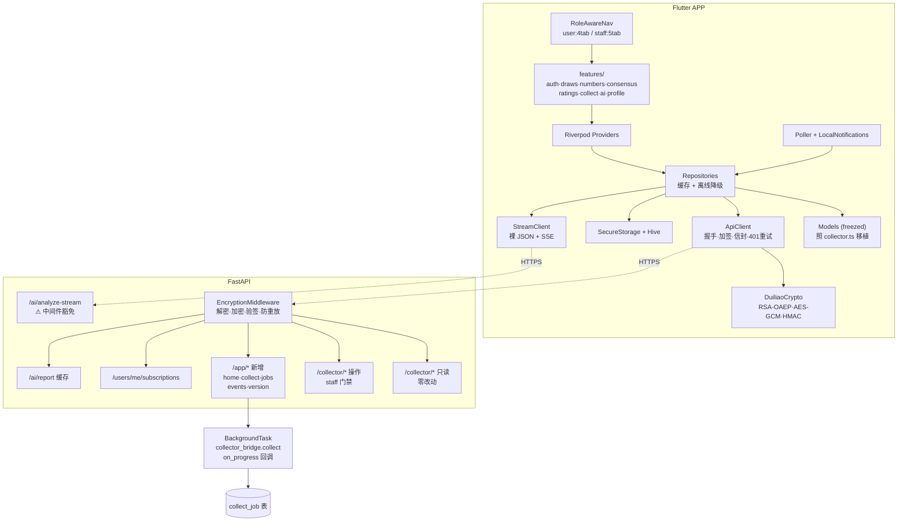
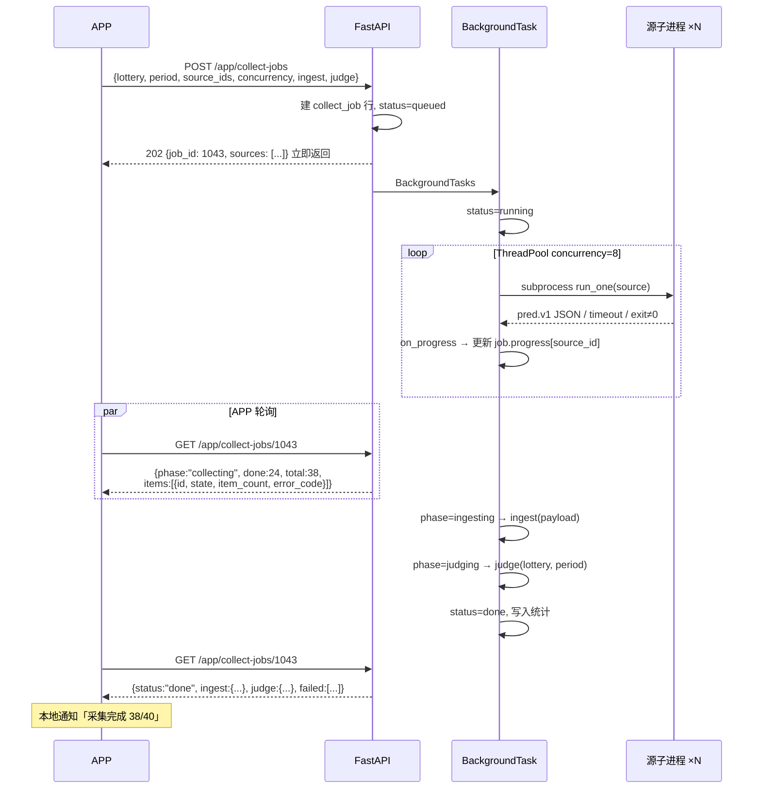

全部确认。逐源实时进度要改 `runner.py`，我先把它和现有的后台执行模式看清楚，再定稿。# 实施方案（定稿）— Duiliao 移动端 APP

## 问题陈述

现有 `duiliao` 是一套六合彩预测源可信度评估平台，后端 FastAPI + 双数据库，前端是 React 管理后台。现在要做一个 **Flutter 运营随身端 APP**，内部分发，让运营人员在手机上完成：看开奖、查共识、评源可信度、以及**执行采集任务**。

## 确认的需求

| 项 | 决定 |
|---|---|
| 定位 | 运营随身端。账号由管理员在 Web 后台创建，APP 无注册入口 |
| 技术栈 | Flutter / Dart，UI 与加密层全部重写 |
| 加密层 | 1:1 全量移植，后端传输层零改动 |
| 权限 | 登录即可用所有只读功能；采集 tab 按 `role` 隐藏（`user` 4 tab，`staff`/`admin` 5 tab） |
| 采集执行 | 纳入范围，含**逐源实时进度** |
| 通知 | 轮询 + 本地通知，不引入第三方推送 |
| 底部导航 | 首页 / 开奖 / 对照 / 评级 / 采集，「我的」在首页右上头像 |
| 分发 | Android APK 直装 + iOS TestFlight / Ad Hoc，不上架 |

线框图已确认，共 10 屏（登录、首页、采集执行三 tab、开奖详情、共识榜、明细对照+证据、评级榜、号码属性、我的+设备）。

---

## 背景：代码确认的关键事实

**可零改动复用的只读接口**（`_user` 角色即可）：`/collector/draws`、`/predictions`、`/consensus`、`/comparison`、`/ratings`、`/monitor`、`/numbers`、`/rules`、`/sources`、`/families`、`/ai/prompts`。

**需 staff/admin 的操作接口**：`/collector/collect`、`/ingest`、`/draws/sync`、`/judge`、`/sources/{id}/test`、`/scripts/{name}/run`、`/schedules/*`、`/comparison/judge`。

`frontend/src/lib/collector.ts` 已把全部响应结构 TypeScript 化（`DrawRow` / `DrawSummary` / `NumberAttr` / `ConsensusResult` / `RatingRow` / `PeriodComparisonResult` / `ComparisonItem` / `CollectionSchedule` 等），**Dart 模型层照它 1:1 移植即可**，不需要反推后端。

**领域约束**：彩种 `hk`/`macau`/`taiwan`/`new`，期号 `年4位+序号3位`，玩法 21 种（`rules.py` `VERSION = "2026-09-06.2"`），号码属性分固定类（波色/大小/单双/头/尾/合数）与农历年轮转类（生肖/家野/五行）。

### 五个必须在方案里处理的现状问题

1. **采集是同步阻塞的**。`collector_bridge.collect()` 用 `executor.map()`，跑完全部源才返回。40 源 × 30s timeout ÷ 并发 8 ≈ 最坏 150s。移动端 HTTP 会超时 → 必须改成提交+轮询。
2. **`session_store` / `nonce_cache` 是进程内内存**（`core/crypto.py:95`）。后端重启后全体 APP 拿到 `401 {code:"no_session"}`。Dart 客户端必须复刻 `api.ts:180` 的重握手重试。多实例部署前这是硬约束。
3. **`/ai/analyze-stream` 完全豁免加密与验签**（`encryption.py:50`），只有 JWT 保护。Dart 侧走独立的裸 JSON + SSE 通道。
4. **`analyze-588080` 默认 `fetch_fresh=True`**，每次调用都由 API 进程外连 588080 + 调 LLM。必须加服务端缓存。
5. **`APP_SIGNING_SECRET` web/app 共用单一密钥**，`verify_signature` 只认一个。APP 先复用，独立密钥列为后续加固。

### 好消息：逐源进度的改动比预估小

`collector_bridge.collect()` 有一份**独立的** ThreadPool 循环（从 `runner.main()` 复制过来的），所以：

- 回调钩子加在 `collector_bridge.collect()`，把 `executor.map()` 换成 `submit()` + `as_completed()`，包一层 `on_start` / `on_done` 回调
- **`runner.py` 完全不动**（`run_one()` 已经返回完整的单源结果字典，`main()` 是独立的 CLI 路径）
- 线框图里要的每个字段都已存在：`source_id`、`ok`、`exit_code`、`elapsed_ms`、`item_count`、`error_code`、`error_msg`、`stdout`、`stderr`

风险因此显著降低——CLI 行为零影响。

---

## 功能清单（最终版）

### M1 账号与安全
1. 登录（identifier = 邮箱/手机/用户名），**无注册入口**
2. Token 管理：access 仅内存，refresh 存 `flutter_secure_storage`
3. 401 自动刷新；刷新失败登出
4. 加密会话自动恢复（`no_session` → 重握手 → 重试一次）
5. 服务端时间偏移校准（握手时记录 offset，签名用校准时间，规避 `bad_timestamp`）
6. 登录设备列表 + 单设备下线 + 全设备登出
7. 修改密码、编辑资料
8. 生物识别解锁

### M2 开奖
9. 开奖列表：4 彩种 tab、分页、下拉刷新
10. 开奖详情：z1–z6 落球顺序 + 特码分区，号码球带色名文字（不只靠颜色）
11. 逐球完整属性：生肖/家野/波色/大小/单双/头/尾/合数/五行 + 灵码
12. 期号汇总：七球和值及大小单双、特码全属性、半波
13. 连肖检测：同肖分组 + 顺位紧邻标记
14. 期号区间筛选

### M3 号码属性百科
15. 01–49 属性总表（按日期，生肖随农历年轮转）
16. 2026 灵码：称谓/花/时辰/地支/生肖色/笔画
17. 生肖分类：天地肖/阴阳肖/男女肖/吉凶肖/季节/方位
18. 属性反查：多维筛选组合
19. 五行缺表年份显式提示

### M4 对照与共识
20. 共识榜：按玩法分组、票数排序、领先方案高亮
21. 投票明细：方案的投票源列表（含 `／第N组`）
22. 特码热度榜（01–49 频次 + 百分比 + 源）
23. 特肖热度榜（12 生肖同上）
24. 期号明细对照：开奖 + 全源预测 + 判定 + 汇总
25. 冲突态突出：源自称中但实判挂
26. 判定证据抽屉：explanation / rule / rule_version / 开奖快照 / 预测快照 / 采集原文
27. 玩法规则百科（21 种，按 scope 分组）

### M5 源评级
28. 评级榜：彩种 + 玩法，30/50/100 三窗口
29. 诚信指标：开奖前 vs 开奖后命中率、改料次数、脏源标记
30. 连续性：连中/连挂/当前状态
31. 覆盖质量：缺期/待判/未覆盖，样本不足显式告警
32. 源详情：基本信息 + 历史预测流水 + 健康度

### M6 采集执行（staff/admin）
33. 立即采集：彩种 / 期号（可自动检测）/ 数据源多选 / 并发滑杆 / ingest + auto-judge 开关
34. **逐源实时进度**：排队 ○ / 运行中 ◌ / 成功 ✓ / 失败 ✗ + 条数 + 错误码
35. 任务结果：入库统计 + 判定统计 + 失败源清单
36. 失败源一键重采
37. 单源试跑（stdout / item_count / 耗时），现场排查用
38. 任务取消
39. 定时任务：列表 / 启停 / 手动触发 / 日志（**不做创建编辑**）
40. 运行记录：按日分组的历史任务流水
41. 开奖同步 + 重新判定手动触发（入口在开奖详情页）

### M7 AI 研判
42. 预置提示词列表
43. 读服务端缓存报告，Markdown 渲染
44. 流式生成（staff/admin 限定）

### M8 订阅与通知
45. 关注数据源（服务端存储，多设备同步）
46. 默认彩种 / 玩法偏好
47. 通知规则：新开奖 / 关注源命中 / 连挂 ≥N / 共识 Top 变动 / 采集任务完成或失败
48. 前台轮询 + 后台周期任务 + 本地通知，游标持久化防重复
49. 消息中心（已读/未读）

### M9 体验层
50. 离线缓存（开奖/号码属性/规则持久化，断网可读 + 离线横幅）
51. 骨架屏 / 空态 / 错误态带重试
52. 深色模式、字号
53. 版本更新检查 + APK 安装引导

### 明确不做
脚本编辑、源 CRUD、定时任务创建编辑、目录扫描、数据库 schema 修复、AI 提供商配置、SQLite 导入。全部留在 Web 后台。

---

## 后端改动清单

新建 `app/api/v1/mobile.py`，前缀 `/app`，挂到现有 `api_router`，**自动继承加密中间件与 JWT**，不新开豁免路径。

| 优先级 | 接口 / 改动 | 说明 |
|---|---|---|
| 必须 | `GET /app/home?lottery=` | 首屏聚合：最新开奖 + 共识摘要 + 评级 Top5 + 对照汇总 + 采集状态 |
| 必须 | `POST /app/collect-jobs` | 提交采集，立即返回 `job_id` |
| 必须 | `GET /app/collect-jobs/{id}` | 轮询：阶段 + 逐源状态 + 统计 |
| 必须 | `DELETE /app/collect-jobs/{id}` | 取消 |
| 必须 | `GET /app/collect-jobs?limit=` | 运行记录 |
| 必须 | `collector_bridge.collect(on_progress=…)` | `executor.map` → `submit` + `as_completed` + 回调 |
| 必须 | `collect_job` 表 | 建在 **collector 库**（与 `Schedule` 同域） |
| 必须 | `user_subscription` 表 + `GET/PUT /users/me/subscriptions` | 建在 **app 库**（用户域），遵守双库隔离 |
| 必须 | `GET /app/events?since=&lottery=` | 轮询通知的增量事件源 |
| 必须 | `GET /app/version?platform=` | 内部分发的更新检查 |
| 强烈建议 | `ai_report` 表 + `GET /ai/report` + `POST /ai/report/generate`（staff） | 避免每用户各自外连 + LLM 计费 |
| 建议 | session_store / nonce_cache 迁 Redis | 单实例可缓，横向扩容前必做 |

全部新表注册进 `db_service.py` 的 schema 校验，让 `main.py:_ensure_schema()` 启动时自动建表。

---

## 技术架构



### 采集任务时序



### 加密层移植对照

Task 1 的验收清单，每行一个互通测试。

| `crypto.ts` | Dart (`webcrypto`) | 易错点 |
|---|---|---|
| `importRsaPublicKey(spkiB64)` | `RsaOaepPublicKey.importSpkiKey(der, Hash.sha256)` | base64 解出是 **DER 字节**，不是 PEM |
| `generateAesSession()` | `AesGcmSecretKey.generateKey(256)` + `exportRawKey()` | |
| `wrapAesKey(pub, raw)` | `pub.encryptBytes(raw)` | **绝不能传 `label`**，后端 `PKCS1_OAEP` 无 label |
| `aesEncrypt` → `{iv, ct‖tag}` | `key.encryptBytes(pt, nonce, tagLength: 128)` | iv 固定 12B；返回值已含 16B tag，别手工再拼 |
| `aesDecrypt` | `key.decryptBytes(blob, nonce, tagLength: 128)` | 传整个 `ct‖tag` |
| `sha256Hex` | `Hash.sha256.digestBytes(d)` → 小写 hex | 无分隔符 |
| `hmacSha256Hex` | `HmacSecretKey.importRawKey(utf8(secret), Hash.sha256).signBytes(utf8(msg))` | secret 按 UTF-8 原始字节 |
| `randomNonceHex(16)` | `fillRandomBytes(Uint8List(16))` → hex | 32 个 hex 字符 |

签名串严格为 `sessionId\ntimestamp\nnonce\nbodyHash`，`\n` 是 LF。`bodyHash` 对**加密后的原始 body 字节**算；无 body 时是空串的 SHA-256（`e3b0c442…`）。`timestamp` 为秒级字符串，窗口 ±300s。

### 依赖

```yaml
webcrypto: ^0.6.1              # 首选；Task 1 验证原生编译
# pointycastle: ^4.0.0         # 兜底：纯 Dart，SPKI 需手写 ASN.1
flutter_riverpod: ^2.6.1
freezed_annotation: ^2.4.4
json_annotation: ^4.9.0
http: ^1.2.2
flutter_secure_storage: ^9.2.4
hive_ce: ^2.7.0
flutter_local_notifications: ^18.0.1
workmanager: ^0.5.2
local_auth: ^2.3.0
flutter_markdown: ^0.7.4
```

`webcrypto` 0.6.1 依赖 Dart SDK ^3.10 与新的 native build hooks（`hooks`/`code_assets`/`native_toolchain_cmake`），部分 Flutter 版本需开 native assets 实验开关。这正是 Task 1 独立前置的理由。

---

## 任务拆解（18 个）

每个任务结束都是一个可运行、可演示的增量。

### Task 1：加密层 spike + Dart↔Python 互通测试
**目标**：证明 `crypto.ts` 每个原语都能与后端对上，选定加密库。

**实现**：建 `duiliao_app` 工程 → 加 `webcrypto` → 先跑 `flutter build apk --debug` 确认原生编译通过（失败则切 `pointycastle`）→ 实现 `lib/core/crypto/duiliao_crypto.dart` → 在 `backend/scripts/` 加互通夹具生成器（导出 RSA 公钥、固定 AES key/iv/明文及密文、固定签名输入及 HMAC 输出为 JSON）→ Dart 测试读夹具逐项断言。

**测试**
- `sha256Hex("")` == `e3b0c44298fc1c149afbf4c8996fb92427ae41e4649b934ca495991b7852b855`
- HMAC 与 Python `hmac.new(secret, "sid\nts\nnonce\nhash", sha256).hexdigest()` 逐字节相等
- Dart 加密的 `{iv, ciphertext}` 能被后端 `aes_decrypt` 解开，反向亦成立
- Dart `wrapAesKey` 产物能被 `decrypt_aes_key` 解开（验证无 label）
- 篡改 ciphertext 一字节 → 解密抛异常

**Demo**：`flutter test` 全绿；终端打印 Dart 加密 → Python 解密的明文回显与选定库。

---

### Task 2：ApiClient — 握手、加签、信封、错误码、时间校准
**目标**：能对真实后端完成握手并发加密请求的网络层。

**实现**：对齐 `api.ts` 结构——`ensureSession()` 单 Future 去重并发握手、`signHeaders()`、`decodeResponse()`（看 `X-Encrypted: 1`）。`ApiException(status, code, message)` 从 `detail.code`/`detail.message`/`detail` 三种形态提取。`SessionStatus` 流供 UI。握手响应记录服务端时间偏移，签名用校准时间。配置走 `--dart-define`。

**测试**
- 并发 10 请求只触发 1 次握手
- mock 401 `no_session` → 重握手 → 重试 → 成功
- 集成测（本地 uvicorn）：`GET /collector/rules` 返回 21 条
- 错误 signing secret → `bad_signature`
- 模拟本地时钟 +400s → 校准后仍成功（而非 `bad_timestamp`）

**Demo**：调试页显示"加密会话已建立 / sessionId 前 8 位 / 时钟偏移 Xms"，并列出 21 种玩法名。

---

### Task 3：登录与会话保持（无注册）
**目标**：完整登录闭环。

**实现**：`AuthRepository` 的 `login` / `refresh` / `logout` / `me`。`device` 传 `{platform: "android"|"ios", deviceName, appVersion, deviceId}`，让 Web 后台设备列表能识别。refresh 存 secure storage，access 只在内存。`AuthGate` 启动时静默登录。`AuthState` 暴露 `role`，供后续导航门禁。**不实现 register，登录页无入口。**

**测试**
- access 过期 → 自动刷新 → 原请求重试成功
- refresh 失效 → 转未登录，secure storage 清空
- 连续 5 次错误密码 → 正确展示账号锁定
- Widget：表单校验、加载态、错误提示、确认无注册入口

**Demo**：真机登录 Web 后台创建的账号，首页显示昵称与角色；杀进程重开免登录；Web 后台"设备会话"能看到这台手机。

---

### Task 4：领域模型层
**目标**：把 `collector.ts` 的契约完整搬成 Dart。

**实现**：逐个移植 `DrawRow` / `DrawSummary` / `NumberAttr` / `LianxiaoGroup` / `AdjacentLianxiao` / `PredAtom` / `ConsensusResult` / `ConsensusGroup` / `AtomTallyItem` / `RatingsResult` / `RatingRow` / `MonitorRow` / `RuleRow` / `PeriodComparisonResult` / `ComparisonItem` / `CollectorSource` / `CollectionSchedule` / `ScriptRunResult`。`freezed` + `json_serializable`。`RatingRow` 的动态键（`hit_30`/`n_50`）用 `Map<String, dynamic>` 承接 + 类型安全取值器。`Lottery` enum + 中文标签，21 个 `PlayType` 中文名。

**测试**：真实响应存 JSON 夹具，每模型一个反序列化测试；边界 `wuxing: null` / `draw: null` / `before_rate: null` / 缺失可选字段全不崩；`RatingRow.hitRate(30)` 在 `hit_30: null` 时返回 null 而非 0。

**Demo**：`flutter test` 全绿；调试页把真实 `/collector/comparison` 响应解析后结构化打印。

---

### Task 5：开奖列表与详情
**实现**：`NumberBall` 组件（按 `bose` 上色 + **色名文字**，特码加边框）。列表页 4 彩种 tab + 分页 + 下拉刷新。详情页落球顺序分区、逐球属性展开、期号汇总卡、连肖区块（同肖分组 + 紧邻标记）。每球带 `Semantics` 标签（"号码 23，红波，小，单，生肖猴"）。

**测试**：三色底色与色名文字正确；特码标记存在；`summary` 为 null 时降级不崩；分页到底显示"没有更多"；开奖详情卡 golden test。

**Demo**：真机切换澳门/香港滑动加载历史开奖，点进任一期看到 7 个带完整属性的号码球与连肖提示。

---

### Task 6：号码属性百科
**实现**：`GET /collector/numbers?date=` + 日期选择器（跨春节生肖变化）。49 格网格 / 列表切换。号码详情弹层：固定属性 + 年度属性 + 灵码 + 生肖分类。反查 tab 多维筛选（波色/大小/单双/头/尾/合数/生肖/家野/五行）实时命中计数。`wuxing_available == false` 显示"该年份无权威五行表"。

**测试**：筛选组合逻辑与手工计算一致；跨春节两日期生肖映射不同；`wuxing: null` 显示占位。

**Demo**：真机选日期看 49 号属性；勾选"绿波+大+双"筛出号码；切春节前后看生肖变化。

---

### Task 7：共识榜
**实现**：彩种 + 期号选择（默认最新一期）。按玩法分组可折叠，领先方案置顶高亮，`tally` 投票源可展开。特码/特肖热度横向条形图按 `percentage`。已开奖时中/挂用**图标 + 文字**双标识。页脚说明"同站族 + 近似文案只计 1 票"。

**测试**：`groups` 空数组显示空态；`leader_votes` 最高组排首位；`atom_tallies` 缺失时区块隐藏；`hit: null`（未开奖）不显示中挂标记。

**Demo**：真机选澳门最新一期，看到分组共识、特码热度条形图、点开看投票源。

---

### Task 8：期号明细对照与判定证据
**实现**：`GET /collector/comparison`。顶部汇总条 + 按状态筛选 tab。每条展示源名/玩法/预测原子/状态徽章。证据抽屉：`explanation` 全文、`rule` + `rule_version`、`draw_snapshot`、`prediction_snapshot`、`raw_text`。`status: "conflict"` 显著标出——**前端不做任何二次判定，一律以后端 `hit_detail` 为唯一真相**。

**测试**：四种 status 映射与徽章；`hit_detail` 为 null 显示"尚未判定"；conflict 可单独筛出。

**Demo**：真机看某期全源对照，点开一条挂了的读到完整判定说明与开奖快照。

---

### Task 9：源评级排行与源详情
**实现**：彩种 + 玩法选择器，窗口 30/50/100。排行卡展示三窗口命中率、连中/连挂/当前状态。诚信区：`before_rate` 与 `after_rate` 并列，差值大时标 ⛔"疑似开奖后改料，命中率不可信"；`after_edits > 0` 标改料次数；`dirty_flags > 0` 标脏源。`n_30` 过小标 ⚠"样本不足"。源详情页：`/sources/{id}` + `/predictions?source_id=` + `/monitor` 健康度。

**测试**：`hit_30: null` 排在有值之后（对齐后端排序）；`n_30 < 10` 触发样本不足；`before_rate` 显著高于 `after_rate` 触发改料告警；横向表头固定列不动。

**Demo**：真机看澳门平特肖评级榜，识别出"开奖后 52% 但开奖前 21%、改料 12 次"的源，点进详情看历史流水。

---

### Task 10：规则百科 + 离线缓存 + 刷新体系
**实现**：规则百科按 `scope` 分组展示 21 条，页脚 `rule_version`。Hive `CacheRepository` 统一 key + TTL：规则与号码属性 7 天，开奖列表最近 50 期，共识/评级 5 分钟。网络失败降级读缓存 + "离线数据 · 更新于 HH:mm"横幅。统一 `AsyncValue` 渲染约定（骨架屏/空态/错误态带重试）。全局下拉刷新绕过缓存。

**测试**：TTL 过期重取、未过期命中缓存；网络异常返回缓存并标 `isStale`；强制刷新绕过缓存；飞行模式下开奖/号码属性/规则仍可浏览。

**Demo**：真机加载后开飞行模式，三个页面仍可浏览并显示离线横幅；关飞行模式下拉恢复。

---

### Task 11：后端 A — 聚合首页、订阅、事件、版本
**实现**：新建 `app/api/v1/mobile.py` 前缀 `/app`。`GET /app/home?lottery=` 一次返回首屏五块数据。`user_subscription` 表建在 **app 库**（`user_id` / `source_ids` / `lotteries` / `play_types` / `notify_rules` JSON / `updated_at`）+ `GET/PUT /users/me/subscriptions`。`GET /app/events?since=&lottery=` 返回 `draw_published` / `source_hit` / `source_miss_streak` / `consensus_leader_changed` / `collect_job_finished`，每条带 `occurred_at` 游标。`GET /app/version?platform=` 配置走 `Setting` 表。全部注册进 `db_service.py` schema 校验。

**测试**（pytest）
- `/app/home` 在空库上返回结构完整的空响应而非 500
- 订阅 PUT 幂等；无效 `source_ids` 被拒
- `/app/events` 边界：`since` 为未来返回空；游标连续拉取不重不漏
- `/app/*` 缺 `X-Session-Id` → `no_session`；缺 Bearer → 401（确认两层保护都继承）
- `/app/version` 未知 platform → 400

**Demo**：扩展 `backend/scripts/e2e_test.py` 跑通新接口，展示 `/app/home` 一次返回首屏全部数据。

---

### Task 12：后端 B — 采集任务 job 化 + 逐源进度上报
**目标**：把阻塞式采集改成移动端可用的提交+轮询，并暴露逐源进度。

**实现**
- `collect_job` 表建在 **collector 库**（`id` / `lottery` / `period` / `source_ids` / `concurrency` / `do_ingest` / `auto_judge` / `status` / `phase` / `progress` JSON / `result` JSON / `run_id` / `created_by` / `created_at` / `started_at` / `finished_at` / `cancel_requested`）
- 改造 `collector_bridge.collect()`：新增可选 `on_progress: Callable` 参数，`executor.map()` → `submit()` + `as_completed()`，worker 内先 `on_start(source_id)` 再执行。**`runner.py` 零改动**
- `POST /app/collect-jobs`（staff）→ 建行 + `BackgroundTasks` → 立即返回 `job_id` 与源清单
- 后台流程：`phase` 依次 `collecting` → `ingesting` → `judging` → `done`；`on_progress` 回调更新 `progress[source_id] = {state, item_count, elapsed_ms, error_code, error_msg}`
- `GET /app/collect-jobs/{id}`、`DELETE`（置 `cancel_requested`，worker 在下一个源前检查）、`GET /app/collect-jobs?limit=`
- 失败源重采：`source_ids` 传上次失败的子集即可，无需新接口

**测试**（pytest，用 `PRED_ALLOW_FIXTURE=1` + `collector/fixtures/dingjian` 离线夹具跑，不碰网络）
- 提交后立即返回且 `status == "queued"`，响应时间 < 200ms
- 轮询能看到 `progress` 从 0 递增到 total，state 流转 `queued → running → ok|fail`
- 某源 timeout 时该源 `error_code == "timeout"`，整个 job 仍完成
- `phase` 按 `collecting → ingesting → judging → done` 推进
- `DELETE` 后剩余源不再执行，job 转 `cancelled`
- 普通 `user` 调 `POST` 返回 403
- `runner.py` 的 CLI 路径回归：`python runner.py --lottery macau --period 248` 行为不变

**Demo**：curl 提交采集 job 立即拿到 id，连续轮询打印逐源状态流转，最后拿到入库 + 判定统计。

---

### Task 13：采集执行 UI — 立即采集 + 进度 + 结果
**实现**：采集 tab 的"立即采集"页——彩种下拉、期号输入 + 自动检测开关、数据源选择抽屉（搜索 / 按玩法与站族筛 / 全选反选 / 显示上次结果）、并发滑杆、ingest + judge 开关。提交后进度卡：进度条 + 已用秒数 + 逐源列表（○ 排队 / ◌ 运行中 / ✓ 成功+条数 / ✗ 失败+错误码）+ 取消按钮。轮询 2s 间隔，离页后台继续。完成态：耗时、成功比、入库统计、判定统计、失败源清单 + "只重采失败源" + "查看本期对照"。

**测试**：轮询响应驱动 UI 状态机（queued/running/done/cancelled/failed）；离页再回页恢复进度；取消后 UI 正确转 cancelled；全部源失败时结果页不崩；Widget 测试数据源选择器的筛选与全选逻辑。

**Demo**：真机选 5 个源发起采集，看到逐源状态实时流转，完成后看到入库与判定统计，点"查看本期对照"跳转。

---

### Task 14：采集执行 UI — 定时任务、运行记录、单源试跑
**实现**：定时任务 tab——调度器状态（运行中/检查间隔/进行中任务数）、任务卡（彩种/源数/并发/cron 或时间窗口/上次结果/下次时间/启停开关/立即执行/日志），页脚说明"新建编辑请在 Web 后台"。运行记录 tab——按日期分组的历史 job 流水。单源试跑：数据源抽屉里长按 → `POST /collector/sources/{id}/test` → 展示 stdout / item_count / 耗时 / stderr。

**测试**：`cron` 与 `time_window` 两种调度模式的展示分支；`last_status == "error"` 正确标红；停用任务不显示下次时间；单源试跑的 `exit_code != 0` 展示 stderr；运行记录按日分组正确。

**Demo**：真机查看 3 个定时任务、启停一个、手动触发一个并看日志；长按某个源试跑看到它的原始 stdout。

---

### Task 15：订阅、轮询与本地通知
**实现**：订阅管理页（搜索勾选源、默认彩种玩法、通知规则开关）。前台轮询 `Timer.periodic` + `AppLifecycleState`（切后台停表，回前台立即拉）。后台：Android `workmanager` 周期任务（最小 15 分钟），iOS `BGTaskScheduler`。本地通知按事件类型分渠道，点击深链。游标 `last_event_cursor` 存 Hive。消息中心本地流水 + 已读未读。**设置页明示"iOS 后台通知由系统调度，不保证及时"。**

**测试**：游标推进——同一事件不通知两次；规则过滤（未订阅源不通知、连挂阈值未达不通知）；切后台停轮询、回前台恢复；mock 返回 3 条事件 → 恰好弹 3 条通知且游标正确前移。

**Demo**：真机订阅两个源 + 开启"采集任务完成"通知，从 APP 发起一次采集后切到后台，完成时收到通知，点击直接跳回任务结果页。

---

### Task 16：AI 研判（含服务端缓存）
**实现**：后端 `ai_report` 表（`lottery`/`period`/`prompt_id`/`content`/`provider`/`model`/`generated_at`/`generated_by`）+ `GET /ai/report`（读缓存，无则 404）+ `POST /ai/report/generate`（**staff/admin**，生成并 upsert）。APP 默认读缓存，Markdown 渲染 + 显示生成时间与模型。流式入口仅 staff/admin 可见，走独立的 `streamRequest()`（裸 JSON + Bearer + SSE 逐行解析 `data:`，识别 `stage: delta|done|error` 与 `[DONE]`）。客户端标注"AI 生成内容，仅供数据参考"。

**测试**：普通 user 调 generate → 403；缓存命中不触发 LLM（mock provider 断言零调用）；同 `(lottery, period, prompt_id)` 重复生成为 upsert；Dart 单测 SSE 分块——一个 `data:` 跨两个网络 chunk 能正确拼接；`stage: error` 触发 `onError`。

**Demo**：普通用户查看已缓存的 AI 报告（Markdown 排版正常）；admin 触发流式生成看到逐字输出并写入缓存。

---

### Task 17：个人中心、角色门禁与首屏整合
**实现**：首页改用 `GET /app/home` 一次渲染。**`RoleAwareNav`：`AuthState.role == "user"` 显示 4 tab（首页/开奖/对照/评级），`staff`/`admin` 显示 5 tab（+采集）**；同时开奖详情的"重新判定"、明细对照的操作按钮也按角色隐藏。我的页：资料编辑、修改密码、设备会话（当前设备标记 + 单个下线 + 全部登出）、生物识别开关、连接状态、深色模式、字号、版本与 `rule_version`、更新检查、退出登录。

**测试**：`role == "user"` 时采集 tab 不存在且深链 `/collect` 被拦；`role == "staff"` 时 5 tab 可达；tab 切换状态保持；踢掉当前设备 → 本地登出；生物识别取消 → 停留锁屏不泄露内容；冷启动到首屏可交互耗时测量。

**Demo**：用 `user` 账号登录只看到 4 个 tab，换 `staff` 账号登录多出采集 tab；个人中心看到 Web 与手机两个设备会话；开启生物识别后重启需指纹解锁。

---

### Task 18：打包与内部分发
**实现**：`--dart-define` 区分环境（`API_BASE_URL` / `APP_SIGNING_SECRET` / `APP_ID`），**secret 由 CI 注入，绝不入库**。Android `flutter build apk --split-per-abi`，签名走 `key.properties`（不入库），APK 直装需 `REQUEST_INSTALL_PACKAGES`。iOS TestFlight 或 Ad Hoc。启动调 `GET /app/version`，低于 `min_supported` 强制更新。在 `.github/` 加打包工作流。文档写明 `APP_SIGNING_SECRET` 轮换流程——改了值旧版 APP 全部 `bad_signature`，必须配合 `min_supported` 同步发布。

**测试**：CI `flutter analyze` + `flutter test` 全绿才打包；Android arm64 与 iOS 各跑一遍登录 + 首屏 + 一次采集 + 一次通知的真机冒烟；手工验证调高 `min_supported` 后弹强制更新。

**Demo**：从 CI 产物装 APK 到真机，登录后全功能可用；服务端调高最低版本后重开 APP 弹强制更新。

---

## 风险与对策

| 风险 | 影响 | 对策 |
|---|---|---|
| `webcrypto` 0.6.1 native build hooks 编不过 | 阻塞全部网络功能 | Task 1 独立前置，`pointycastle` 兜底（额外约 40 行 ASN.1 解析） |
| 后端重启导致全体 `no_session` | 莫名 401 | Task 2 实现重握手重试；长期迁 Redis |
| 设备时钟偏差 > 300s | 全部请求 `bad_timestamp` | Task 2 的服务端时间偏移校准 |
| 后端多实例部署 | 内存态 session/nonce 导致随机 401 | Redis 之前保持单实例。**这是硬约束，不是优化项** |
| 采集 job 在 BackgroundTasks 里跑，进程重启即丢 | job 卡在 `running` | 启动时把超过阈值仍 `running` 的 job 标记为 `interrupted` |
| iOS 后台轮询时机不可控 | 通知延迟数小时 | 设置页明示；前台打开立即拉取 |
| `APP_SIGNING_SECRET` 可从 APK 提取 | 签名层防护价值有限 | 已知取舍，用户级安全靠 JWT；轮换配合 `min_supported` |
| AI 接口被滥用 | 外连 + LLM 账单失控 | Task 16 缓存 + 生成权限限 staff/admin |
| 小样本命中率误导决策 | 基于 n=3 的 100% 做判断 | Task 9 强制显示样本量并告警 |

## 工期估算（单人）

| 阶段 | 任务 | 估时 |
|---|---|---|
| 基础设施 | Task 1–4 | 5–7 天（Task 1 走兜底 +2 天） |
| 只读功能 | Task 5–10 | 10–14 天 |
| 后端改造 | Task 11–12 | 6–8 天 |
| 采集 UI | Task 13–14 | 6–8 天 |
| 通知与 AI | Task 15–16 | 5–6 天 |
| 收尾分发 | Task 17–18 | 4–5 天 |
| **合计** | **18 个任务** | **约 6–8 周** |

---
